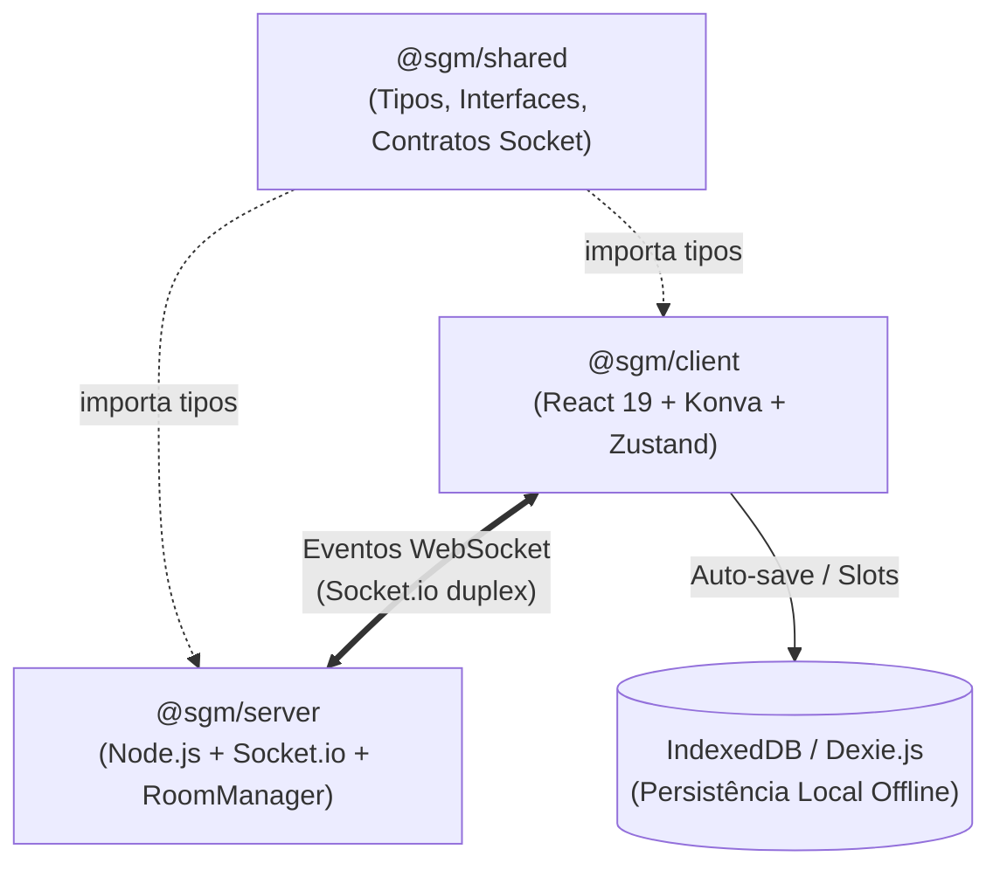
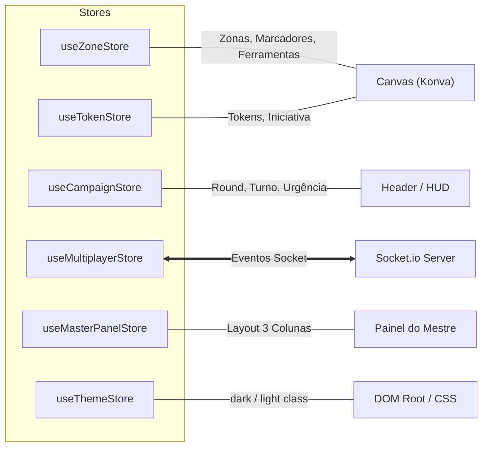
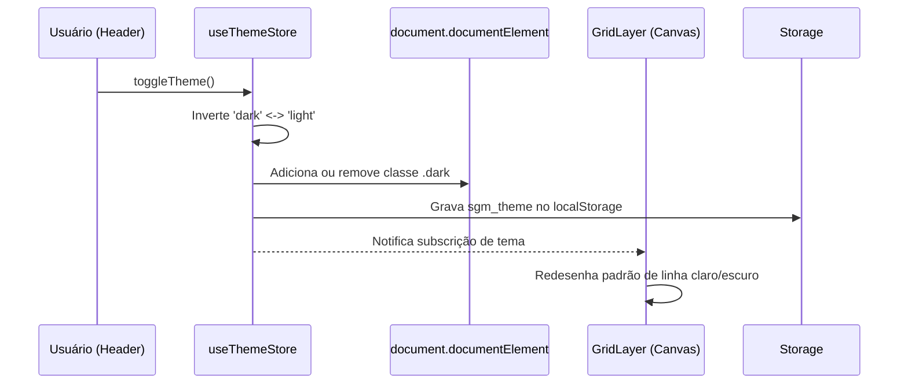
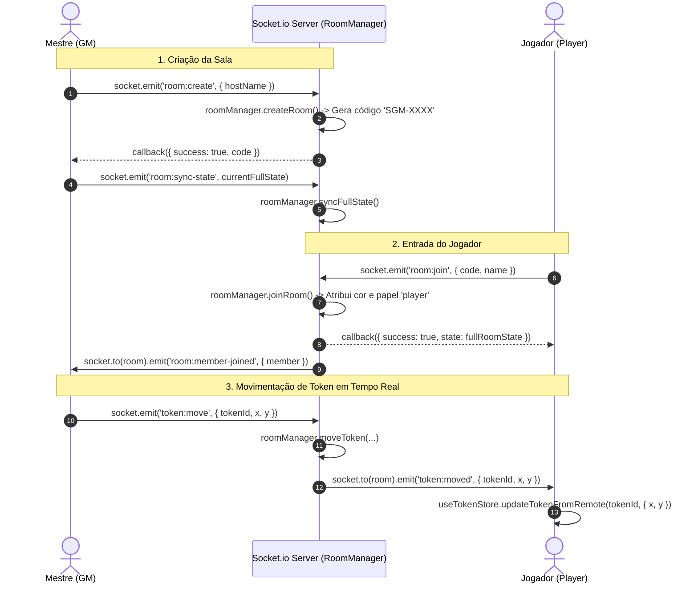

# 📐 Arquitetura Técnica — Sistema Gerenciador de Mesas (SGM)

> **Documentação Técnica e Guia Arquitetural do SGM v7.0**  
> Visão estrutural, renderização em canvas, gerenciamento de estado, design system e protocolo de comunicação em tempo real.

---

## 1. Visão Geral da Arquitetura

O SGM adota uma arquitetura de **Monorepo** gerenciada via **npm workspaces**, desacoplando contratos de dados, interface de usuário e servidor de sincronização em tempo real.

```
projeto_pedro/Sistema-Gerenciador-de-Mesas--SGM-/
├── shared/     # @sgm/shared: Modelos de dados, contratos de eventos e tipos TypeScript
├── client/     # @sgm/client: Aplicação SPA em React 19, Konva, Tailwind e Zustand
├── server/     # @sgm/server: Servidor Node.js com Express e Socket.io
└── docs/       # Documentações de arquitetura e manuais do sistema
```

### Pacotes do Workspace

| Pacote       | Nome no Workspace | Tecnologias Principais                                 | Responsabilidade                                                                                                                                                  |
| :----------- | :---------------- | :----------------------------------------------------- | :---------------------------------------------------------------------------------------------------------------------------------------------------------------- |
| **`shared`** | `@sgm/shared`     | TypeScript (types only)                                | Contratos estritos de WebSocket (`socketEvents.ts`), tipagens de entidades do jogo (`game.ts`) e modelos de sala (`room.ts`). Não possui dependências de runtime. |
| **`client`** | `@sgm/client`     | React 19, Vite, Konva, Zustand, Tailwind CSS, Dexie.js | Frontend SPA completo. Responsável pelo Battlemap 2D interativo, Painel do Mestre modular, persistência local no IndexedDB e cliente WebSocket.                   |
| **`server`** | `@sgm/server`     | Node.js, Express, Socket.io, TSX                       | Servidor WebSocket de tempo real. Gerencia salas voláteis em memória (`RoomManager`) e faz o broadcast de eventos e sincronização entre GM e jogadores.           |

### Diagrama de Dependências e Comunicação



---

## 2. Canvas e Renderização (Konva)

O Battlemap é implementado sobre o **React-Konva** (wrapper React do Konva.js), operando sobre a API Canvas 2D com aceleração de hardware.

### 2.1 Viewport e Sistema de Coordenadas (`StageMap.tsx`)

O componente [`StageMap`](client/src/canvas/StageMap.tsx) orquestra o canvas e resolve a transformação entre tela e mapa:

1. **Transformação Relativa do Ponteiro**:
   O canvas suporta escala (zoom de 0.1x a 8x) e translação (pan). A conversão da posição de tela para o sistema de coordenadas do mundo é feita invertendo a matriz de transformação do Konva:
   ```ts
   const transform = stage.getAbsoluteTransform().copy().invert();
   const worldPos = transform.point(stage.getPointerPosition());
   ```
2. **Zoom Centrado no Cursor**: O evento de roda do mouse calcula o novo fator de escala e ajusta a posição `(x, y)` do `Stage` para manter o ponto sob o cursor fixo durante a aproximação/afastamento.
3. **Gerenciamento de Cursores e Ferramentas**:
   - `pan`: Cursor `grab` ou `grabbing` (permite arrastar o palco com botão esquerdo ou barra de espaço pressionada).
   - `select`: Cursor `crosshair` para retângulo de seleção em área ou `default`/`pointer` sobre nós.
   - `draw-rect` / `draw-ellipse` / `draw-poly` / `add-marker`: Cursor `crosshair`.
   - `edit-bg`: Cursor `move` (para manipular imagens de fundo).
     O cursor é sincronizado tanto no elemento DOM externo quanto no container interno do Konva.

### 2.2 Hierarquia de Camadas (Layers)

Para garantir 60 FPS e evitar re-renderizações desnecessárias durante o desenho ou movimentação, o canvas é dividido em três camadas lógicas:

```
Stage (Root)
 ├── Layer 1: [Fundo e Grid]
 │    ├── GridLayer          (Grid repetitivo de alta performance)
 │    └── BackgroundLayer    (Imagens estáticas de mapa/cenário)
 │
 ├── Layer 2: [Entidades Interativas]
 │    ├── ZoneLayer          (Zonas de efeito: retângulos, elipses, polígonos)
 │    ├── TokenLayer         (Tokens de personagens e criaturas)
 │    ├── MarkerLayer        (Marcadores SVG e Pings multiplayer em tempo real)
 │    └── Selection Marquee  (Retângulo de seleção em lote)
 │
 └── Layer 3: [Overlay de Rascunho / Feedback]
      └── DrawingLayer       (Prévia da forma geométrica sendo desenhada)
```

#### Responsabilidade de Cada Camada

- **`GridLayer`**: Renderiza a malha tática com células de 40px. Desenha uma única célula em um canvas offscreen e a aplica como padrão de preenchimento (`fillPatternImage`) em um retângulo expandido (`[-10000, 10000]`). Opera com `listening={false}` e `perfectDrawEnabled={false}`, eliminando o overhead de milhares de nós de linha individuais.
- **`BackgroundLayer`**: Renderiza instâncias de imagens de cenário (`BgImage`). Quando a ferramenta `edit-bg` está ativa, os nós tornam-se `draggable`, exibem borda tracejada dourada e permitem ajuste de escala pelo scroll do mouse.
- **`ZoneLayer`**: Desenha áreas táticas persistentes (retângulos, elipses e polígonos) com cor de preenchimento translúcida, borda e rótulos de texto centralizados cujo tamanho de fonte é escalonado dinamicamente com o zoom do mapa.
- **`TokenLayer`**: Renderiza círculos de tokens com imagens ou iniciais estilizadas, bordas de status/seleção e rótulo de nome inferior. Suporta arrasto individual ou sincronizado em lote (múltipla seleção via Shift+Clique ou marquee). Tokens do tipo "ameaça" têm o arrasto bloqueado para quem estiver no papel de jogador.
- **`MarkerLayer`**: Renderiza ícones de ponto de interesse (pin, espada, baú, caveira, joia) com vetores SVG e deslocamento correto de ancoragem. Também renderiza os **Pings táticos** em tempo real disparados por usuários (`Alt + Clique` ou botão do meio), exibindo ondas pulsantes e crachá com o nome do emissor que desaparecem após 3.5 segundos.
- **`DrawingLayer`**: Camada isolada com `listening={false}` que renderiza a geometria em tempo real durante a criação de uma nova forma (`newShape`). Manter esta camada separada garante que o mousemove em alta frequência não provoque re-renderização das camadas de tokens ou zonas.

---

## 3. Gerenciamento de Estado (Zustand Stores)

O gerenciamento de estado cliente é feito com [Zustand](https://zustand.docs.pmnd.rs/), organizado em stores atômicas e especializadas localizadas em `client/src/store/`:



### Detalhamento das Stores

1. **`useZoneStore`**
   - **Responsabilidade**: Armazena as zonas geométricas (`zones`), marcadores táticos (`markers`), imagens de fundo (`bgImages`), ferramenta ativa (`activeTool`), IDs selecionados (`selectedNodeIds`) e dimensões das barras laterais.
   - **Padrão Dual-Action**: Implementa ações locais (ex: `addZone`, `updateMarker`) que atualizam o estado local, acionam o auto-save e emitem via socket, além de ações remotas correspondentes (ex: `addZoneFromRemote`) que apenas atualizam o estado local ao receber mensagens do servidor sem gerar loops de eco.

2. **`useTokenStore`**
   - **Responsabilidade**: Catálogo de tokens (`tokens`), lista de ordenação de combate (`initiativeQueue`), identificador do token com menu contextual aberto (`activeCtxTokenId`) e token em edição de ficha (`editingTokenId`).
   - **Sincronização**: Emite `token:move`, `token:update`, `token:add`, `token:remove` e `initiative:update`. Processa atualizações remotas via métodos `*FromRemote`.

3. **`useMasterPanelStore`**
   - **Responsabilidade**: Controla a exibição e o layout flexível do Painel do Mestre (`isOpen`, `layout`).
   - **Layout Três Colunas**: Gerencia a ancoragem dos subpainéis (`diary`, `rules`, `scenes`, `soundpad`, `table`, `roulette`, `notes`) nos slots `left`, `center` e `right`, com algoritmo interno que impede o mesmo subpainel de ocupar múltiplos slots simultaneamente.

4. **`useThemeStore`**
   - **Responsabilidade**: Alternância de tema (`theme: 'dark' | 'light'`).
   - **Efeito Imediato**: Persiste a preferência em `localStorage` (`sgm_theme`) e injeta/remove a classe `.dark` diretamente em `document.documentElement`. O padrão inicial é o tema escuro (`dark`), otimizado para sessões imersivas de RPG.

5. **`useMultiplayerStore`**
   - **Responsabilidade**: Estado da sessão online (`isConnected`, `roomId`, `role: 'gm' | 'player'`, `members`, `pings`).
   - **Hub de Conexão**: Registra os listeners do socket uma única vez no boot (`setupSocketListeners`), distribuindo os dados recebidos para `useTokenStore`, `useZoneStore` e `useCampaignStore`. Fornece as funções `createRoom`, `joinRoom`, `leaveRoom` e `sendPing`.

6. **`useCampaignStore`**
   - **Responsabilidade**: Fluxo de narrativa e combate da mesa (`scene`, `round`, `turn`, `urgency`, `turnsPerRound`).
   - **Persistência & Modais**: Controla a visibilidade dos modais de salvamento/carregamento, gerencia o slot de Auto-Save ativo (`autoSaveSlot`) e emite atualizações de rodada e turno (`campaign:update-round-turn`).

---

## 4. Design System & Temas

O SGM utiliza uma abordagem de **Tokens Semânticos CSS** integrada com Tailwind CSS e componentes baseados em shadcn/ui.

### 4.1 Estrutura de Tokens (`client/src/index.css`)

Os tokens são definidos sob `@layer base` em `:root` (modo claro) e `.dark` (modo escuro padrão):

```css
/* Exemplo de tokens semânticos SGM */
:root {
  --bg-canvas: #e8e8ec;
  --bg-app: #f4f4f7;
  --bg-surface: #ffffff;
  --border-subtle: #e2e2e8;
  --text-main: #121214;
  --brand-purple: #7042dc;
  --brand-gold: #b8860b;
}

.dark {
  --bg-canvas: #0d0d0f;
  --bg-app: #121214;
  --bg-surface: #18181b;
  --bg-surface-elevated: #202024;
  --border-subtle: #27272a;
  --border-muted: #323238;
  --text-main: #f4f4f5;
  --text-muted: #a1a1aa;
  --brand-purple: #8257e5;
  --brand-green: #04d361;
  --brand-gold: #ffd700;
  --brand-red: #e55757;
  --brand-cyan: #2ac7e3;
}
```

### 4.2 Integração com Tailwind (`tailwind.config.js`)

Os tokens CSS são estendidos diretamente no tema do Tailwind, permitindo classes utilitárias semânticas no JSX:

- `bg-canvas`, `bg-app`, `bg-surface`, `bg-surface-elevated`
- `text-main`, `text-muted-custom`
- `border-subtle`, `border-muted`
- Cores temáticas: `brand-purple`, `brand-green`, `brand-gold`, `brand-red`, `brand-cyan`

### 4.3 Alternador Claro / Escuro



---

## 5. Comunicação Multiplayer em Tempo Real

A comunicação multiplayer utiliza WebSockets bidirecionais via **Socket.io**, garantindo sincronização com latência mínima entre os participantes da mesa.

### 5.1 Componentes do Fluxo

1. **`RoomManager` (`server/src/roomManager.ts`)**:
   - Singleton em memória no Node.js.
   - Gerencia salas identificadas por códigos curtos (ex: `SGM-7X2A`).
   - Mantém o estado autoritativo volátil da sessão (`ActiveRoom`): lista de membros, tokens, fila de iniciativa, imagens de fundo, zonas, marcadores, rodada e turno.
   - Desaloca salas automaticamente quando todos os membros se desconectam.

2. **`socketHandlers` (`server/src/handlers/socketHandlers.ts`)**:
   - Mapeia os eventos tipados de `ClientToServerEvents` e `ServerToClientEvents`.
   - Modifica o estado no `RoomManager`.
   - Executa broadcasts direcionados: `socket.to(room.code).emit(...)` para os outros membros ou `io.to(room.code)` para todos.

3. **`useMultiplayerStore` (`client/src/store/useMultiplayerStore.ts`)**:
   - Centraliza o socket do cliente, iniciação de salas e parsing dos eventos de rede.
   - Despacha mutações recebidas do servidor diretamente para os stores clientes via chamadas `*FromRemote`.

### 5.2 Fluxo de Eventos: Criação, Entrada e Sincronização de Estado



### 5.3 Prevenção de Loops de Eco (Echo Loop Avoidance)

Para evitar condições de corrida e loops infinitos de emissão entre cliente e servidor, adota-se a regra de separação de ações:

- **Ação do Usuário Local**: Invoca `store.updateItem(...)` $\rightarrow$ atualiza o estado local + emite evento socket (`item:update`).
- **Ação de Rede Remota**: O listener socket no `useMultiplayerStore` recebe `item:updated` $\rightarrow$ invoca `store.updateItemFromRemote(...)` $\rightarrow$ atualiza o estado local **sem re-emitir** qualquer evento socket.

### 5.4 Pings Táticos de Mapa

Qualquer jogador ou mestre pode emitir um ping pressionando `Alt + Clique` ou o botão central do mouse sobre o canvas:

1. `StageMap` captura o clique e converte para coordenadas de mundo.
2. `useMultiplayerStore.sendPing(x, y)` emite `map:ping`.
3. O servidor empacota as coordenadas com nome e cor do membro e faz broadcast de `map:pinged`.
4. `MarkerLayer` renderiza o pulso animado com badge de nome e programa remoção automática após 3.5 segundos.
