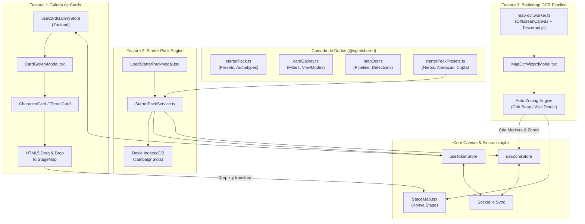
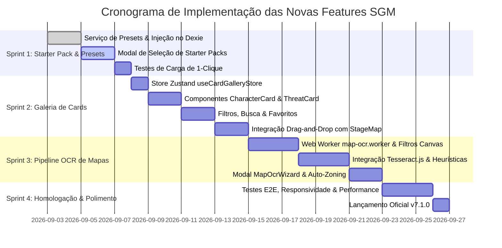

# Roadmap Técnico e Especificação de Arquitetura: Novas Funcionalidades SGM (v7.1+)

Este documento estabelece as especificações arquiteturais, modelos de dados, fluxo de integração e planejamento de engenharia para as 3 próximas grandes funcionalidades do **Sistema Gerenciador de Mesas (SGM)**:

1. **Tela/Galeria de Cards de Personagens e Ameaças** (Compêndio visual de cards RPG/TCG com filtros, busca e arrastar para o tabuleiro)
2. **Assets e Presets Prontos para Rodar (Starter Pack)** (Campanhas demo, fichas genéricas balanceadas e mapas táticos carregados em 1 clique)
3. **Pipeline de OCR para Mapas de Batalha** (Processamento assíncrono de mapas via Web Workers e Tesseract.js para auto-criação de Zonas e Marcadores)

---

## 1. Visão Geral da Arquitetura e Princípios de Engenharia

O SGM opera sob uma arquitetura de alta performance fundamentada em:

- **Core Frontend**: React 19 + TypeScript + Vite + Tailwind CSS + Lucide Icons.
- **Renderização Tática**: HTML5 Canvas acelerado por Konva / React-Konva (`StageMap.tsx`), operando a 60 FPS com suporte a Pan, Zoom, transformações geométricas e camadas independentes (`BackgroundLayer`, `ZoneLayer`, `TokenLayer`, `MarkerLayer`, `DrawingLayer`).
- **Gerenciamento de Estado Reativo**: Zustand 5 com stores desacopladas e comunicantes (`useTokenStore`, `useZoneStore`, `useCampaignStore`, `useMasterPanelStore`, `useCardGalleryStore`).
- **Persistência Local & Offline-First**: IndexedDB via Dexie 4 (`db.ts`), estruturado em slots de campanha com salvamento automático desacoplado (`triggerAutoSave` com debounce).
- **Sincronização em Tempo Real**: WebSocket via Socket.io com payload tipado compartilhado em `@sgm/shared`.

### Diagrama de Integração dos Novos Subsistemas



---

## 2. Feature 1: Tela/Galeria de Cards de Personagens e Ameaças

### 2.1. Objetivo & Experiência do Usuário (UX)

Substituir a visualização restrita de tokens (atualmente limitada a círculos pequenos na barra superior do `Header.tsx`) por uma **Galeria Visual de Alta Densidade** inspirada em card games e compêndios de RPG (como _Hearthstone_, _Magic: The Gathering_, _Pathfinder 2e Archives_ e _D&D Beyond_).

A galeria oferece:

1. **Visão Panorâmica**: Exibição em grade de cards personalizáveis, diferenciando Jogadores de Ameaças através de paletas de cor, bordas elementais e molduras de raridade/perigo.
2. **Busca e Filtros Instantâneos**: Busca textual (nome, iniciais, habilidades, lore) combinada com filtros multifacetados (tipo, elemento, presença em mapa, NEX/VD, favoritos).
3. **Ação de Puxar para o Tabuleiro (Drag-and-Drop e 1-Click)**:
   - Arrastar o card do modal diretamente sobre o mapa tático.
   - Botão "Enviar ao Centro da Visão" para uso rápido sem necessidade de arrasto.
   - Recolher do mapa para a reserva (definindo `x: null, y: null`).
4. **Inspeção e Manipulação Rápida**:
   - Abrir ficha completa (`TokenSheetModal`) com 1 clique.
   - Ajustes imediatos de PV/PE/SAN sem sair da galeria.
   - Duplicação instantânea de ameaças (útil para bandos de lacaios como Goblins e Zumbis).

### 2.2. Arquitetura de Componentes UI

```
client/src/components/card-gallery/
├── CardGalleryModal.tsx         # Modal principal / Janela em tela cheia com atalho 'C'
├── CardGalleryToolbar.tsx       # Barra superior com busca, seletor de visão e contadores
├── CardFilterDrawer.tsx         # Painel lateral expansível com filtros multifacetados
├── CardGrid.tsx                 # Grade responsiva de cards com virtualização
├── CardListView.tsx             # Visualização compacta em formato tabela/linhas
├── CharacterCard.tsx            # Card específico para fichas de Jogador (Player)
├── ThreatCard.tsx               # Card estilizado para Ameaças (Threat) com indicadores de NEX/VD
└── CardQuickActionsMenu.tsx     # Menu contextual / hover com ações rápidas
```

#### Anatomia Visual do Card

- **Topo**: Retrato/Arte do Personagem (`imageUrl` recortada) com moldura temática baseada no elemento (`Sangue`, `Morte`, `Conhecimento`, `Energia`, `Medo`).
- **Badge Superior Direito**: Indicador de Tipo (`Jogador` vs `Ameaça - VD XX` ou `NEX XX%`).
- **Badge Superior Esquerdo**: Status de presença no mapa (`No Tabuleiro [x,y]` vs `Na Reserva`).
- **Centro**: Nome completo, arquétipo/classe e iniciais do token.
- **Barra de Vitais**:
  - Jogadores: Barras coloridas de PV (Vermelho), PE (Amarelo/Dourado) e SAN (Roxo/Azul).
  - Ameaças: Barra de PV e indicador de Pontos de Determinação/Esforço.
- **Atributos Principais**: Mini-hexágono ou badges de AGI, FOR, INT, PRE, VIG e Defesa (DEF/BLOQ/ESQ).
- **Rodapé de Ações**:
  - Ícone de Lupa (Inspecionar Ficha).
  - Ícone de Estrela (Favoritar).
  - Ícone de Mira/Mapa (Arrastar ou posicionar no mapa).
  - Ícone de Clonar (Criar cópia com sufixo `#2`, `#3`).

### 2.3. Modelagem de Estado (`useCardGalleryStore`)

Tipagem implementada em `@sgm/shared/src/types/cardGallery.ts`:

- `CardGalleryViewMode`: `'grid-standard' | 'grid-compact' | 'table'`
- `CardFilterState`: parâmetros reativos para busca, classes, tipos, elementos, status de mapa, ordenação (`sortBy`, `sortOrder`) e favoritos.
- `CardDragData`: payload estruturado contendo `{ type: 'sgm-token-card', tokenId: string, source: 'gallery' }`.

### 2.4. Mecânica de Arrastar para o Tabuleiro (`StageMap.tsx`)

No `StageMap.tsx`, a captura de drop de tokens já utiliza:

```typescript
const stageBox = stage.container().getBoundingClientRect();
const stageX = e.clientX - stageBox.left;
const stageY = e.clientY - stageBox.top;
const worldX = (stageX - position.x) / scale;
const worldY = (stageY - position.y) / scale;
```

A Galeria de Cards fornece no evento `onDragStart`:

```typescript
e.dataTransfer.setData('text/plain', token.id);
e.dataTransfer.setData(
  'application/json',
  JSON.stringify({
    type: 'sgm-token-card',
    tokenId: token.id,
  }),
);
```

Isso garante compatibilidade retroativa total com o drag-and-drop existente no canvas do SGM, posicionando o token exatamente na coordenada do grid onde o cursor for solto.

---

## 3. Feature 2: Assets e Presets Prontos para Rodar (Starter Pack)

### 3.1. Objetivo & Valor

Permitir que qualquer Mestre de RPG inicie uma sessão ou teste a plataforma **em menos de 10 segundos**, sem a necessidade de criar manualmente fichas, preencher atributos, definir valores de defesa ou desenhar zonas de mapa.

### 3.2. Catálogo de Fichas Genéricas Balanceadas

Fundações concretas implementadas em `@sgm/shared/src/data/starterPackPresets.ts`:

#### 1. Fichas de Heróis (Players)

| Arquétipo     | Papel Tático               | Atributos (AGI/FOR/INT/PRE/VIG) | Defesas (DEF/BLOQ/ESQ)   | Vitais (PV/PE/SAN)    | Destaque Mecânico                                                        |
| :------------ | :------------------------- | :------------------------------ | :----------------------- | :-------------------- | :----------------------------------------------------------------------- |
| **Guerreiro** | Vanguarda / Tanque         | 2 / 3 / 1 / 1 / 3               | DEF 16 / BLOQ 5 / ESQ 14 | 24 PV / 2 PE / 12 SAN | Ataque Especial (+5 teste / +1d8 dano), Postura Defensiva com Escudo     |
| **Ladino**    | Infiltração / Dano Crítico | 4 / 1 / 3 / 2 / 1               | DEF 15 / BLOQ 0 / ESQ 18 | 16 PV / 3 PE / 14 SAN | Ataque Furtivo (+2d6 dano), Esquiva Sagaz (redução de dano à metade)     |
| **Mago**      | Conjurador / Controle      | 1 / 1 / 4 / 3 / 1               | DEF 12 / BLOQ 0 / ESQ 12 | 12 PV / 6 PE / 20 SAN | Rituais Arcanos, Disparo Elemental de Energia, Onda de Sono em Área      |
| **Clérigo**   | Suporte / Protetor         | 1 / 2 / 2 / 4 / 2               | DEF 15 / BLOQ 3 / ESQ 13 | 18 PV / 5 PE / 18 SAN | Canalizar Luz (Cura 2d8+3), Aura de Proteção Sagrada (+2 Defesa passiva) |

#### 2. Fichas de Ameaças (Threats)

| Ameaça     | Classificação         | Elementos      | Atributos (AGI/FOR/INT/PRE/VIG) | Vitais / Defesas         | Ações & Habilidades Assinatura                                                                         |
| :--------- | :-------------------- | :------------- | :------------------------------ | :----------------------- | :----------------------------------------------------------------------------------------------------- |
| **Goblin** | Lacaio (Bando)        | Realidade      | 3 / 1 / 1 / 1 / 1               | 8 PV / DEF 13 / ESQ 15   | Ataque em Bando (+2 por aliado adjacente), Fuga Ágil (Desengajar livre), Adaga Enferrujada             |
| **Zumbi**  | Padrão (Morto-Vivo)   | Morte / Sangue | 1 / 3 / 0 / 1 / 3               | 22 PV / DEF 11 / BLOQ 4  | Resistência a Balístico 5, Pancada Pesada, Mordida Infecciosa, Implacável (recusa a morte no 0 PV)     |
| **Dragão** | Chefe (Titã Lendário) | Energia / Medo | 3 / 5 / 3 / 4 / 5               | 120 PV / DEF 24 / BLOQ 8 | Presença Perturbadora (2d8 Medo DT 22), Sopro de Fogo em Cone 9m (8d6), Mordida Voraz, Ações Lendárias |

### 3.3. Mapa Tático Padrão: "Cripta dos Ecos Ancestrais"

- **Resolução & Grid**: 2000x1500px, grade tática de 50px com snap automático.
- **Zonas Predefinidas**:
  1. _Sala 1 - Vestíbulo dos Guardiões_: Inscrições rúnicas com pistas e gatilho de emboscada goblin.
  2. _Sala 2 - Corredor dos Miasmas_: Passagem estreita com névoa corrosiva e levante de zumbis.
  3. _Sala 3 - Santuário do Dragão Carmesim_: Salão abobadado com tesouro dracônico e trono do chefe.
- **Marcadores Interativos**: Marcadores numerados ("1", "2", "3") e ícones contextuais (`skull`, `sword`, `chest`).
- **Posições de Spawn Pré-Calculadas**: Posições iniciais balanceadas para os 4 heróis e as ameaças da cena.

### 3.4. Motor de Injeção de Presets (`StarterPackService`)

Estrutura para o serviço de carregamento:

```typescript
interface StarterPackLoadOptions {
  targetSlot?: number;
  loadMode: 'new_slot' | 'overwrite_current' | 'append_content';
  selectedCharacterIds?: string[];
  selectedThreatIds?: string[];
  selectedMapIds?: string[];
  includeRulesAndNotes: boolean;
  autoPlaceOnBoard: boolean;
}
```

- **Modo `new_slot`**: Encontra o primeiro slot livre de 1 a 50 no Dexie e grava a campanha demo sem tocar na sessão aberta.
- **Modo `overwrite_current`**: Hidrata os stores (`useTokenStore`, `useZoneStore`, `useCampaignStore`, `useNotesStore`, `useRulesStore`) com o starter pack completo e dispara auto-save.
- **Modo `append_content`**: Injeta apenas as fichas ou mapa selecionado na campanha atual, mantendo as zonas e fichas que o Mestre já possuía.

---

## 4. Feature 3: Pipeline de OCR para Mapas de Batalha

### 4.1. O Problema & A Solução

Mestres utilizam centenas de mapas de aventuras oficiais (D&D, Ordem Paranormal, Tormenta20, Pathfinder) ou mapas de cartógrafos (Dyson Logos, Czepeku, 2-Minute Tabletop). A maioria desses mapas vem com **números de sala impressos na imagem** (ex: "1", "2", "3", "12A", "Cripta").
Hoje, o Mestre gasta de 30 a 60 minutos criando manualmente cada Zona e Marcador sobre o mapa.

O **Pipeline de OCR do SGM** processa o mapa de forma assíncrona, reconhece os números/rótulos e gera automaticamente:

1. **Marcadores (`Marker`)** com os números correspondentes nas coordenadas exatas.
2. **Zonas Táticas (`Zone`)** em volta de cada sala com títulos preenchidos (ex: "Sala 1"), prontos para receber notas, armadilhas e POIs.

### 4.2. Arquitetura Não-Bloqueante com Web Worker

O processamento de imagens pesadas (4K/8K) e execução de redes neurais do Tesseract em JavaScript são operações intensivas em CPU. Para garantir **zero congelamento da interface** e manter os 60 FPS da renderização do Konva, todo o pipeline é isolado em um Web Worker dedicado:

```
client/src/workers/
└── map-ocr.worker.ts            # Web Worker dedicado (OffscreenCanvas + Tesseract.js)
client/src/services/
└── MapOcrService.ts             # Cliente gerenciador de lifecycle e mensageria com o Worker
client/src/components/modals/
└── MapOcrWizardModal.tsx        # Assistente visual de importação e aprovação de salas
```

### 4.3. Pipeline de Filtros e Pré-Processamento de Imagem

```mermaid
graph LR
    Input["Imagem do Mapa<br/>(PNG/JPG/DataURL)"] --> Worker["map-ocr.worker.ts"]
    Worker --> Canvas["OffscreenCanvas 2D"]
    Canvas --> Gray["1. Escala de Cinza<br/>(Luminance Weight)"]
    Gray --> Contrast["2. Realce de Contraste<br/>& Normalização"]
    Contrast --> Threshold["3. Binarização<br/>(Otsu / Adaptativa)"]
    Threshold --> Invert["4. Inversão Opcional<br/>(Mapas Escuros)"]
    Invert --> Upscale["5. Upscaling 1.5x<br/>(Foco em Dígitos)"]
    Upscale --> Tesseract["Tesseract.js OCR<br/>(PSM 11 + Whitelist)"]
    Tesseract --> PostProcess["Post-Processing &<br/>Spatial Clustering"]
    PostProcess --> AutoZone["Heurística de Zonas<br/>(Grid Snap / Wall Detect)"]
    AutoZone --> Wizard["MapOcrWizardModal<br/>(Revisão do Mestre)"]
```



#### Etapas Matemáticas do Filtro (Canvas 2D):

1. **Luminância Ponderada**:
   $$Y = 0.299 \cdot R + 0.587 \cdot G + 0.114 \cdot B$$
2. **Realce de Contraste**:
   $$Pixel_{out} = \text{clamp}\left(128 + \text{contrast} \cdot (Pixel_{in} - 128), 0, 255\right)$$
3. **Limiarização de Otsu**:
   Calcula o limiar ótimo $T$ que maximiza a variância entre classes de pixels de texto (pretos) e pixels de fundo (brancos), eliminando texturas de grid e papel envelhecido.
4. **Upscaling Bilinear**:
   Dígitos pequenos em mapas de alta resolução (ex: número de 12px em imagem de 4000px) sofrem de baixa amostragem; um upscaling local melhora a acurácia de reconhecimento em mais de 40%.

### 4.4. Configuração Especializada do Tesseract.js

- **Whitelist Restrita**:
  `charWhitelist: "0123456789ABCDEFGHIJKLMNOPQRSTUVWXYZabcdefghijklmnopqrstuvwxyz# -"`
  Impede que ruídos de folhas ou hachuras de parede sejam interpretados como caracteres exóticos (`~`, `§`, `©`, `µ`).
- **Modo de Segmentação (PSM - Page Segmentation Mode)**:
  - `PSM 11` (_Sparse Text_): Encontra textos dispersos sem estrutura de parágrafos/linhas (ideal para mapas).
  - `PSM 6` (_Uniform Text Block_): Para legendas agrupadas no canto do mapa.
- **Filtro de Regex e Confiança**:
  - Aceita rótulos com padrão: `/^(\d{1,3}[A-Za-z]?|[A-Za-z]\d{1,2}|Sala\s*\d+|Room\s*\d+)$/i`.
  - Descarta candidatos com confiança OCR inferior a `50%`.

### 4.5. Heurísticas de Auto-Zoning (Criação de Zonas e Marcadores)

A partir do centro do texto detectado $(X_c, Y_c)$:

1. **Marcador Instantâneo**:
   Cria um `Marker` em $(X_c, Y_c)$ com `text = rótulo` e ícone `pin`.
2. **Delimitação de Zona**:
   - _Estratégia 1: Grid Snap_: Ajusta uma zona retangular para cobrir o quadrante de grade mais próximo (ex: 4x4 células de 50px = 200x200px).
   - _Estratégia 2: Fixed Padding Expansion_: Cria uma zona retangular de tamanho proporcional à escala do mapa centralizada no número.
   - _Estratégia 3: Flood-Fill Wall Detection (Avançada)_: Algoritmo de preenchimento que se expande a partir do número até colidir com pixels escuros contínuos que representam as paredes da sala.

### 4.6. Interface do Assistente (`MapOcrWizardModal.tsx`)

O Mestre nunca é forçado a aceitar detecções cegas:

- Uma tela modal exibe o mapa com retângulos semitransparentes sobre cada sala detectada.
- Lista lateral com todas as salas ("Sala 1", "Sala 2", "Sala 3...").
- O Mestre pode desmarcar salas que foram falsos positivos (ex: um símbolo de bússola lido como "0").
- Botão final: **"Gerar X Zonas e Marcadores no Mapa"**, que comita tudo atomicamente no `useZoneStore`.

---

## 5. Matriz de Tipagens e Estrutura de Código

As tipagens completas já foram integradas e validadas no compilador TypeScript (`tsc -b --noEmit` com 0 erros):

| Domínio               | Arquivo Fonte Compartilhado             | Re-exportação no Cliente          | Principais Estruturas                                                                                                   |
| :-------------------- | :-------------------------------------- | :-------------------------------- | :---------------------------------------------------------------------------------------------------------------------- |
| **Galeria de Cards**  | `shared/src/types/cardGallery.ts`       | `client/src/types/cardGallery.ts` | `CardFilterState`, `CardGalleryState`, `CardDragData`, `CardVisualTheme`, `CardActionPayload`                           |
| **Starter Pack**      | `shared/src/types/starterPack.ts`       | `client/src/types/starterPack.ts` | `PresetCharacterTemplate`, `PresetThreatTemplate`, `PresetBattlemap`, `StarterCampaignPreset`, `StarterPackLoadOptions` |
| **Presets Concretos** | `shared/src/data/starterPackPresets.ts` | Exportado via `@sgm/shared`       | `STARTER_CHARACTERS` (4 fichas), `STARTER_THREATS` (3 fichas), `STARTER_BATTLEMAP`, `DEFAULT_STARTER_CAMPAIGN`          |
| **Pipeline OCR**      | `shared/src/types/mapOcr.ts`            | `client/src/types/mapOcr.ts`      | `MapOcrPipelineConfig`, `OcrDetectedRoom`, `MapOcrPipelineResult`, `MapOcrWorkerRequest`, `MapOcrWorkerResponse`        |
| **Conteúdo de Mesa**  | `shared/src/types/content.ts`           | `client/src/types/`               | `NotePage`, `RulePage`, `TablePage`, `RoulettePage`, `DiaryEntry`                                                       |

---

## 6. Cronograma de Implementação & Sprints



### Detalhamento dos Entregáveis por Sprint

#### Sprint 1: Fundação do Starter Pack (Dias 1 a 5)

- [x] Criação das tipagens em `shared/src/types/starterPack.ts` e `content.ts`.
- [x] Criação dos presets detalhados dos 4 Heróis, 3 Ameaças e Mapa da Cripta em `shared/src/data/starterPackPresets.ts`.
- [ ] Implementação de `StarterPackService.ts` com métodos `loadStarterCampaign(options)`.
- [ ] Adição do botão "Starter Pack / Demonstração" no menu "Arquivo" do `Header.tsx` e modal de boas-vindas para novos usuários (quando o banco estiver vazio).

#### Sprint 2: Galeria de Cards & Drag-and-Drop (Dias 6 a 12)

- [x] Criação das tipagens em `shared/src/types/cardGallery.ts`.
- [ ] Implementação da store `useCardGalleryStore.ts`.
- [ ] Criação do `CardGalleryModal.tsx` com atalho de teclado `C` e acionador no Header.
- [ ] Componentes de visualização `CharacterCard.tsx` e `ThreatCard.tsx` com animações suaves e cores elementais.
- [ ] Validação do drag-and-drop da galeria para o `StageMap.tsx`.

#### Sprint 3: Pipeline de OCR de Mapas de Batalha (Dias 13 a 20)

- [x] Criação das tipagens de pipeline e worker em `shared/src/types/mapOcr.ts`.
- [ ] Adição do pacote `tesseract.js` no `client/package.json`.
- [ ] Implementação de `map-ocr.worker.ts` com filtros de escala de cinza, realce de contraste e binarização adaptativa.
- [ ] Implementação do serviço `MapOcrService.ts` e do assistente visual `MapOcrWizardModal.tsx`.
- [ ] Integração com `useZoneStore` para injeção automática de `Zone` e `Marker`.

#### Sprint 4: Homologação, Performance & Lançamento (Dias 21 a 24)

- [ ] Validação de FPS contínuo (> 55 FPS) durante operações de arrasto e pan no canvas.
- [ ] Auditoria de memória e liberação de URLs temporárias (`URL.revokeObjectURL`) no processamento de imagens.
- [ ] Validação com `npm run typecheck`, `npm run lint` e `npm run build`.

---

## 7. Critérios de Aceite & Performance Budgets

1. **Taxa de Quadros do Canvas**: O Canvas Konva não pode sofrer oscilações abaixo de 50 FPS durante a abertura da galeria de cards ou durante o processamento de OCR no Worker em background.
2. **Tempo de Resposta de Busca na Galeria**: Filtragem e renderização dos cards com menos de 16ms (1 frame de latência) para listas de até 150 tokens.
3. **Velocidade do OCR**: Processamento completo de imagem de mapa Full HD (1920x1080) em menos de 4 segundos em computadores convencionais de usuários.
4. **Precisão Mínima do OCR**: Taxa de acerto superior a 80% em números de sala impressos com contraste padrão.
5. **Robustez de Dados**: Qualquer preset carregado deve ser salvo no IndexedDB via Dexie e persistir após recarregamento da página (F5) sem perdas de integridade relacional.
