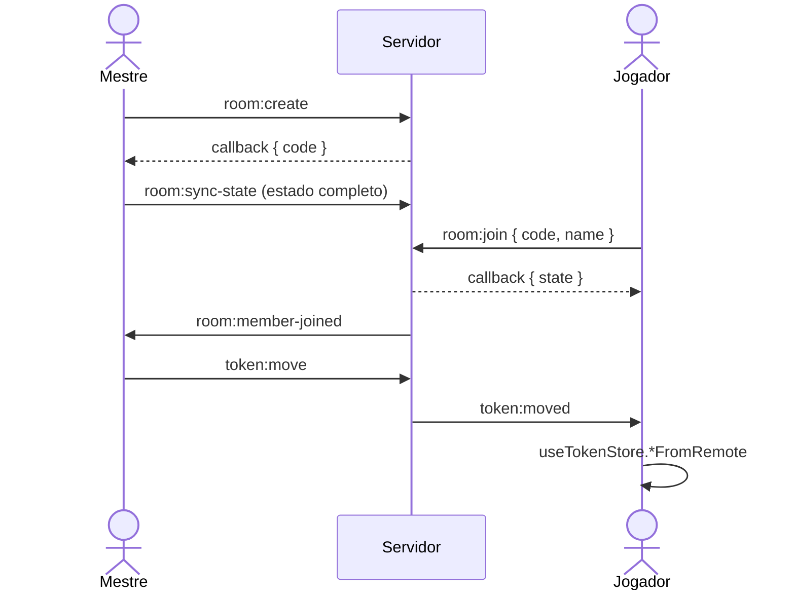

# Multiplayer e Servidor

> Este documento descreve o modelo **atual**. O modelo alvo (servidor como autoridade, validação com Zod, salas persistidas) está em [`../plans/modernizacao-arquitetural.md`](../plans/modernizacao-arquitetural.md).

## Componentes

| Arquivo                                 | Papel                                                                                                                           |
| :-------------------------------------- | :------------------------------------------------------------------------------------------------------------------------------ |
| `server/src/index.ts`                   | Express com CORS e JSON, rota `/api/auth` e Socket.io (`maxHttpBufferSize` de 20 MB)                                            |
| `server/src/roomManager.ts`             | Singleton com as salas em um `Map` na memória. Código de sala no formato `SGM-XXXX`. Sala é removida quando o último membro sai |
| `server/src/handlers/socketHandlers.ts` | Um handler por evento: atualiza o `RoomManager` e retransmite para a sala                                                       |
| `src/types/multiplayer.ts`              | Contratos `ClientToServerEvents` e `ServerToClientEvents`, usados pelos dois lados                                              |
| `src/lib/socket.ts`                     | Instância única do cliente Socket.io (`autoConnect: false`, até 5 tentativas de reconexão)                                      |
| `src/store/useMultiplayerStore.ts`      | Cria e entra em salas, registra os listeners e repassa eventos recebidos para os outros stores                                  |

## Eventos

| Cliente emite                                             | Servidor retransmite                                                 | Destino                      |
| :-------------------------------------------------------- | :------------------------------------------------------------------- | :--------------------------- |
| `room:create`                                             | callback com o código                                                | quem criou                   |
| `room:join`                                               | callback com o estado + `room:member-joined`, `room:members-updated` | quem entrou / sala           |
| `room:sync-state`                                         | `room:state-synced`                                                  | outros membros               |
| `token:move`, `token:update`, `token:add`, `token:remove` | `token:moved`, `token:updated`, `token:added`, `token:removed`       | outros membros               |
| `initiative:update`                                       | `initiative:updated`                                                 | outros membros               |
| `campaign:update-round-turn`                              | `campaign:round-turn-updated`                                        | outros membros               |
| `bg:add`, `bg:update`, `bg:remove`                        | `bg:added`, `bg:updated`, `bg:removed`                               | outros membros               |
| `zone:add`, `zone:update`, `zone:remove`                  | `zone:added`, `zone:updated`, `zone:removed`                         | outros membros               |
| `marker:add`, `marker:update`, `marker:remove`            | `marker:added`, `marker:updated`, `marker:removed`                   | outros membros               |
| `map:ping`                                                | `map:pinged` (com nome e cor)                                        | todos, inclusive quem enviou |
| `room:leave`, `disconnect`                                | atualização de membros                                               | sala                         |

## Fluxo de uma sessão

## Regra anti-eco (modelo atual)

- Ação local: o store atualiza o estado e emite o evento.
- Evento recebido: o listener chama `*FromRemote`, que só atualiza o estado e **nunca** emite.

## Como adicionar um evento

1. Declare o evento em `ClientToServerEvents` e `ServerToClientEvents` (`src/types/multiplayer.ts`).
2. Trate em `server/src/handlers/socketHandlers.ts` e, se o estado da sala mudar, em `roomManager.ts`.
3. No store do domínio, crie a ação local (emite) e a `*FromRemote` (não emite).
4. Registre o listener em `useMultiplayerStore`.

## Limitações atuais

- Não há verificação de permissão: qualquer membro pode enviar qualquer evento, inclusive `room:sync-state`.
- Payloads não são validados.
- Salas se perdem quando o servidor reinicia.
- Imagens trafegam como Data URL em Base64.

## Autenticação (`/api/auth`)

| Rota             | Função                                             |
| :--------------- | :------------------------------------------------- |
| `POST /register` | Cadastro com usuário e senha (hash com `bcryptjs`) |
| `POST /login`    | Login, cria sessão                                 |
| `POST /google`   | Login com Google OAuth                             |
| `POST /logout`   | Encerra a sessão                                   |
| `GET /me`        | Usuário da sessão atual                            |

Tabelas no Postgres (criadas em `server/src/db/db.ts`): `users`, `sessions`, `campaigns`. Sem `DATABASE_URL`, as rotas respondem que o banco está offline e o app continua funcionando localmente.
