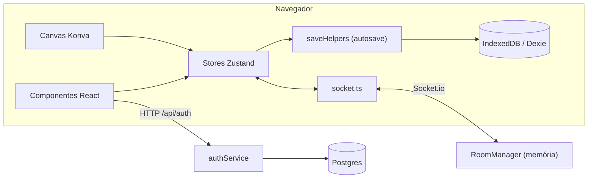

# Visão Geral

## Processos

| Processo | Código        | Porta (dev)    | Responsabilidade                                              |
| :------- | :------------ | :------------- | :------------------------------------------------------------ |
| Cliente  | `src/`        | 5173 (Vite)    | SPA React 19: battlemap, painel do mestre, persistência local |
| Servidor | `server/src/` | 3001 (`PORT`)  | Express (`/api/auth`) e Socket.io (salas multiplayer)         |
| Banco    | —             | `DATABASE_URL` | Postgres: usuários, sessões e campanhas                       |
| Processo | Código         | Porta (dev)    | Responsabilidade                                              |
| :------- | :------------- | :------------- | :------------------------------------------------------------ |
| Cliente  | `apps/web/`    | 5173 (Vite)    | SPA React 19: battlemap, painel do mestre, persistência local |
| Servidor | `apps/server/` | 3001 (`PORT`)  | Express (`/api/auth`) e Socket.io (salas multiplayer)         |
| Banco    | —              | `DATABASE_URL` | Postgres: usuários, sessões e campanhas                       |

Um único `package.json` na raiz. Não há npm workspaces.
Monorepo estruturado com npm workspaces na raiz (`apps/*`, `packages/*`).



## Pastas

```
src/
  canvas/              StageMap.tsx e camadas (Grid, Background, Zone, Token, Marker, Drawing)
  components/
    initiative/        Barra de iniciativa
    layout/            AppLayout, Header, Footer
    master-panel/      Subpainéis: diary, notes, roulettes, rules, scenes, soundpad, tables
    modals/            Auth, Initiative, Load/Save, Multiplayer, TokenCreate, TokenSheet, ZoneMarker
    sidebar/           SidebarLeft (maior arquivo do projeto), SidebarRight
    tokens/            Condições e status
    toolbar/           Ferramentas do mapa
    ui/                Primitivos shadcn e componentes genéricos
  lib/                 db.ts, saveHelpers.ts, socket.ts, spotifyAuth.ts, spotifyPlayer.ts, uuid.ts
  store/               Stores Zustand
  types/               Tipos do domínio (game, multiplayer, auth, diary, notes, ...)
server/src/
  index.ts             Express + Socket.io
  roomManager.ts       Salas em memória
  handlers/            socketHandlers.ts
  routes/              authRoutes.ts
  services/            authService.ts
  db/                  Pool Postgres e criação de tabelas
apps/
  web/src/
    canvas/            StageMap.tsx e camadas (Grid, Background, Zone, Token, Marker, Drawing)
    components/
      initiative/      Barra de iniciativa
      layout/          AppLayout, Header, Footer
      master-panel/    Subpainéis: diary, notes, roulettes, rules, scenes, soundpad, tables
      modals/          Auth, Initiative, Load/Save, Multiplayer, TokenCreate, TokenSheet, ZoneMarker
      sidebar/         SidebarLeft, SidebarRight
      tokens/          Condições e status
      toolbar/         Ferramentas do mapa
      ui/              Primitivos shadcn e componentes genéricos
    lib/               db.ts, saveHelpers.ts, socket.ts, spotifyAuth.ts, spotifyPlayer.ts, uuid.ts
    store/             Stores Zustand
    types/             Reexportações compatíveis de @sgm/shared
  server/src/
    index.ts           Express + Socket.io
    roomManager.ts     Salas em memória
    handlers/          socketHandlers.ts
    routes/            authRoutes.ts
    services/          authService.ts
    db/                Pool Postgres e criação de tabelas
packages/
  shared/src/
    domain/            Schemas Zod e tipos das entidades de jogo
    protocol/          Schemas Zod e eventos de socket
    api/               Schemas de autenticação e rotas HTTP
    constants/         Limites e configurações compartilhadas
  engine/src/          Regras puras do jogo e autoridade de salas
```

## Variáveis de ambiente

| Variável                 | Onde     | Uso                                                      |
| :----------------------- | :------- | :------------------------------------------------------- |
| `PORT`                   | servidor | Porta HTTP/Socket.io (padrão 3001)                       |
| `DATABASE_URL`           | servidor | Conexão Postgres. Sem ela, auth responde "banco offline" |
| `VITE_SERVER_URL`        | cliente  | URL do servidor. Padrão: `http://<hostname atual>:3001`  |
| `VITE_SPOTIFY_CLIENT_ID` | cliente  | Integração com Spotify no soundpad                       |

## Dívidas conhecidas

Detalhadas em [`../plans/modernizacao-arquitetural.md`](../plans/modernizacao-arquitetural.md), seção 3. Em resumo: o servidor não valida nem autoriza eventos, as salas vivem só em memória, imagens trafegam em Base64 pelo socket e `saveHelpers.ts` tem dependência circular com os stores.
