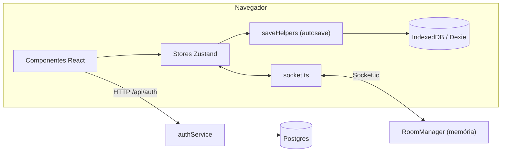

# Visão Geral

Monorepo npm workspaces (`apps/*`, `packages/*`).

| Processo | Código         | Porta (dev)    | Faz                                                      |
| :------- | :------------- | :------------- | :------------------------------------------------------- |
| Cliente  | `apps/web/`    | 5173           | SPA React 19: mapa, painel do mestre, persistência local |
| Servidor | `apps/server/` | 3001 (`PORT`)  | Express (`/api/auth`) e Socket.io (salas)                |
| Banco    | —              | `DATABASE_URL` | Postgres: usuários, sessões e campanhas                  |



## Pastas

```
apps/web/src/
  canvas/          StageMap e camadas
  components/      initiative, layout, master-panel, modals, sidebar, tokens, toolbar, ui
  lib/             db.ts, saveHelpers.ts, socket.ts, spotify*, uuid.ts
  store/           stores Zustand
  types/           reexportações de @sgm/shared
apps/server/src/
  index.ts         Express + Socket.io
  roomManager.ts   salas em memória
  handlers/        socketHandlers.ts
  routes/          authRoutes.ts
  services/        authService.ts
  db/              pool Postgres
packages/shared/src/   domain/, protocol/, api/, constants/ (schemas Zod)
packages/engine/src/   regras puras (esqueleto; completo no bloco 2)
```

## Variáveis de ambiente

| Variável                 | Onde     | Uso                                               |
| :----------------------- | :------- | :------------------------------------------------ |
| `PORT`                   | servidor | Porta (padrão 3001)                               |
| `DATABASE_URL`           | servidor | Postgres. Sem ela, auth responde "banco offline"  |
| `VITE_SERVER_URL`        | cliente  | URL do servidor. Padrão: `http://<hostname>:3001` |
| `VITE_SPOTIFY_CLIENT_ID` | cliente  | Spotify no soundpad                               |

Dívidas conhecidas: [plano](../plans/modernizacao-arquitetural.md), seção 3.
