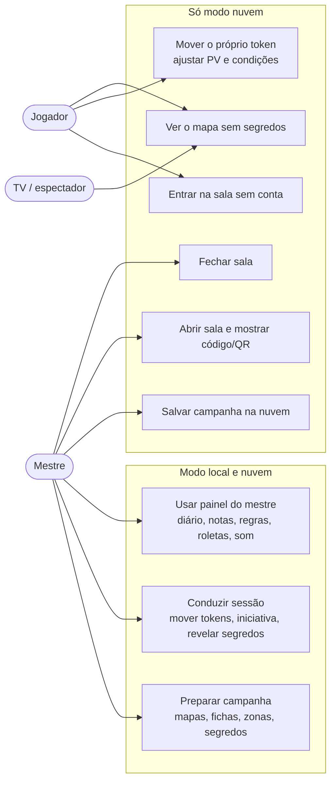
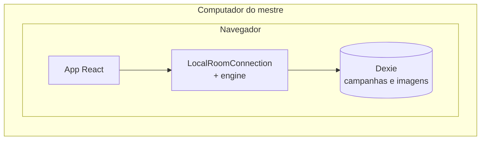
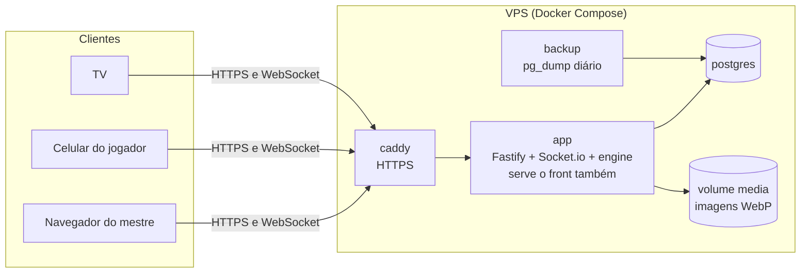

# 1. Visão geral

O SGM é uma mesa virtual de RPG: um mapa 2D com tokens, um painel do mestre (diário, notas, regras, tabelas, roletas, trilha sonora) e, no modo nuvem, jogadores conectados pelo celular ou de casa.

## Dois modos, um app

| | Modo local | Modo nuvem |
| :-- | :-- | :-- |
| Precisa de | Só o navegador | Conta e internet (ou rede local) |
| Onde a campanha mora | No navegador (Dexie) | No servidor (Postgres) |
| Jogadores conectados | Não. Todos olham a mesma tela | Sim, por código ou QR, sem conta |
| Quem usa | O Pedro hoje. Grátis, sem cadastro | O produto |
| Passagem | "Salvar na nuvem" move a campanha local para a conta | "Baixar cópia" exporta um JSON |

Os dois modos usam o **mesmo código de tela e as mesmas regras**. A única diferença é a `RoomConnection` que a tela recebe (ver [3. Arquitetura](3-arquitetura.md)).

Uma campanha tem **um dono por vez**: ou está no navegador, ou está no servidor. Não há sincronização nos dois sentidos, porque é o que mais gera conflito e perda de dados nesse tipo de app.

## Casos de uso

## Onde cada parte roda (implantação)

### Modo local

Nada sai do navegador. Funciona sem internet depois que a página carregou.

### Modo nuvem

Um servidor (VPS) com Docker Compose. O container `app` serve a página e a API na mesma origem, então não há CORS nem problema de cookie.

### Rede local (bônus)

A mesma imagem Docker roda no notebook do mestre. Os jogadores entram pelo Wi-Fi da casa (`http://192.168.x.x`). Não exige trabalho extra, mas não é prioridade.

## O que já existe e o que falta

| Parte | Hoje (v8 na `next`) | Alvo |
| :-- | :-- | :-- |
| Monorepo, contratos Zod, CI com `npm run check` | Pronto | — |
| Modo local | Funciona, mas com autosave frágil (`saveHelpers`) | `LocalRoomConnection` + engine |
| Engine | Esqueleto: `token.move/add/remove`, mestre pode tudo | Todas as regras e permissões, com projeção |
| Servidor | Express + Socket.io que só repassa eventos, salas em memória | Fastify, autoritativo, salas no Postgres |
| Conta | Auth feito à mão | Better Auth |
| Imagens | Base64 dentro do estado | Upload, WebP e referência por hash |
| Docker e deploy | Não existe | Bloco 1 do plano |
| Visual e responsividade | Cores soltas, pouco responsivo | Design system (bloco 2) |
