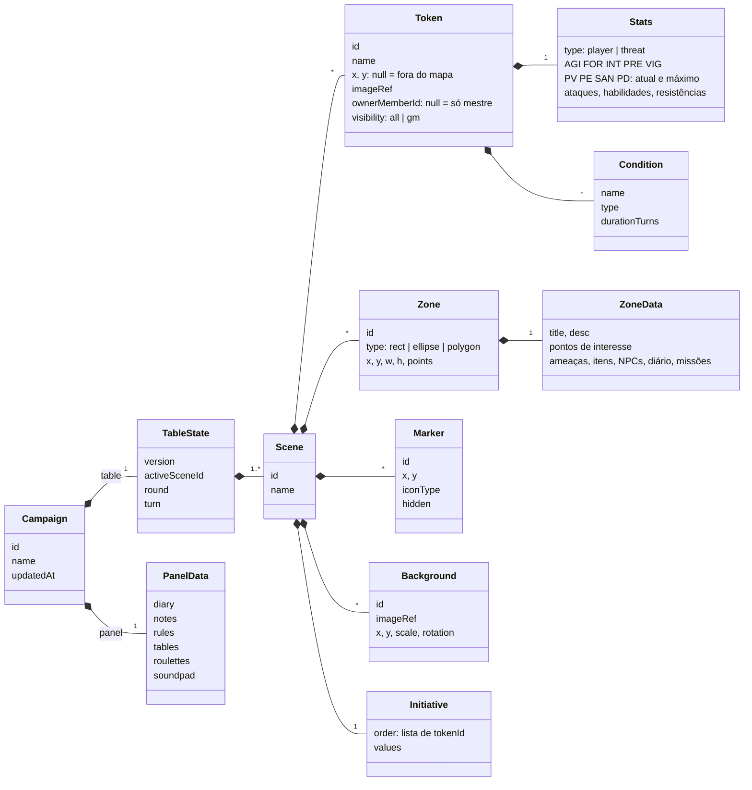
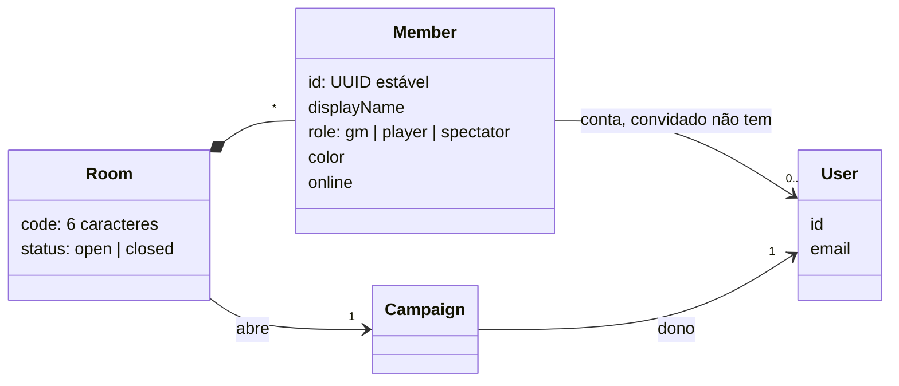
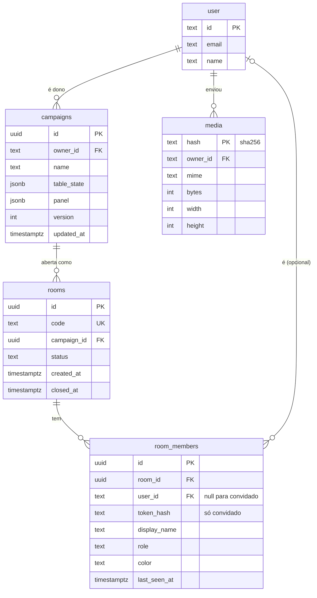

# 2. Modelo de dados

## Campanha, mesa e painel

A campanha é dividida em duas partes, porque elas têm regras diferentes:

- **Mesa** (`table`): cenas, tokens, zonas, marcadores, fundos, iniciativa. É o que os jogadores veem numa sala. Toda mudança passa pelo engine como comando.
- **Painel** (`panel`): diário, notas, regras, tabelas, roletas e trilha sonora do mestre. Nunca vai para os jogadores. É salvo direto (Dexie no modo local, `PATCH` HTTP no modo nuvem), sem engine.

Essa divisão deixa o engine pequeno: ele só conhece a mesa.

Coleções ficam como `Record<id, item>` (não arrays): achar, atualizar e remover por id fica simples e sem ambiguidade.

Hoje o código ainda está no formato antigo: `tokens` e `bgImages` em arrays, iniciativa como fila, `round`/`turn` no `useCampaignStore` e o painel espalhado em seis stores. A troca acontece nos blocos 2 e 3 do plano.

## Sala e membros (só modo nuvem)

Uma **sala é uma campanha aberta ao vivo**. Ela não tem estado próprio: o estado é a `table` da campanha, que o servidor mantém em memória enquanto a sala está aberta e grava no banco a cada 2 segundos.

- O papel `gm` é só do dono da campanha. Nunca por ordem de chegada.
- Convidado não tem conta: recebe um `memberToken` guardado no navegador. Ao voltar, o token devolve a mesma identidade.
- O `socket.id` nunca é identidade, porque muda a cada reconexão.

## O que é segredo

Antes de enviar qualquer coisa para um jogador ou para a TV, o servidor aplica `projectFor(table, member)`:

| Removido para jogador e TV | Campo |
| :-- | :-- |
| Outras cenas | Só a cena ativa é enviada |
| Tokens escondidos | `visibility: 'gm'` |
| Ficha de ameaça | `stats` de `type: 'threat'` (ficam nome, imagem, posição e condições) |
| Marcadores escondidos | `hidden: true` |
| Itens de zona não revelados | `isRevealed: false` e `isFound: false` |
| Painel inteiro | Nunca entra na sala |

## Banco do servidor (Postgres)

As tabelas `user`, `session`, `account` e `verification` são criadas pelo Better Auth. O projeto não cria tabela própria de usuário.

Campanha e cenas ficam em `jsonb`, não em tabelas normalizadas: o jogo sempre carrega e grava a campanha inteira, e o schema Zod em `@sgm/shared` garante o formato.

## Banco do navegador (Dexie)

| Tabela | Chave | Conteúdo |
| :-- | :-- | :-- |
| `campaigns` | `id` | Campanhas locais (`table` e `panel`) |
| `media` | `hash` | Imagens das campanhas locais, como Blob |

Imagens são referenciadas por hash: `local:<hash>` no modo local e `/media/<hash>.webp` no servidor. Ao salvar na nuvem, as imagens locais sobem e as referências são trocadas.

Hoje o Dexie tem outro formato (`campaignSlots` com 50 slots fixos, `activeScenes` e `sessionState`), e as imagens ficam em Base64 dentro do estado. Isso some no bloco 2.
