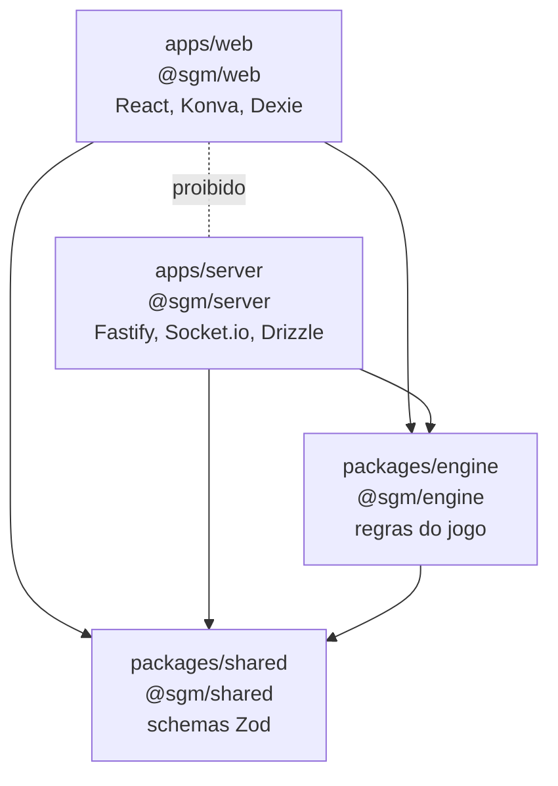
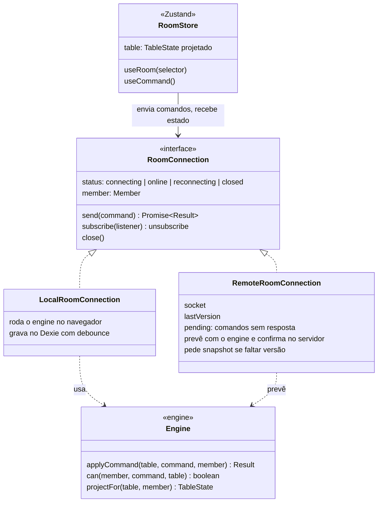
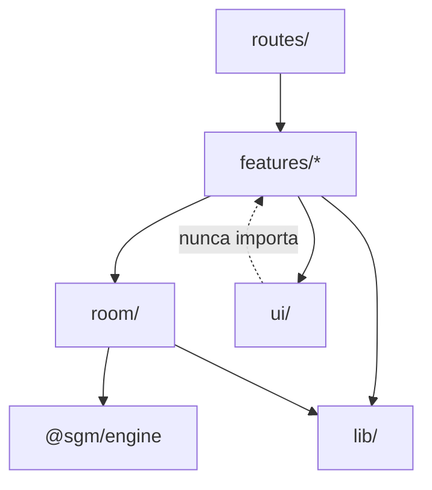
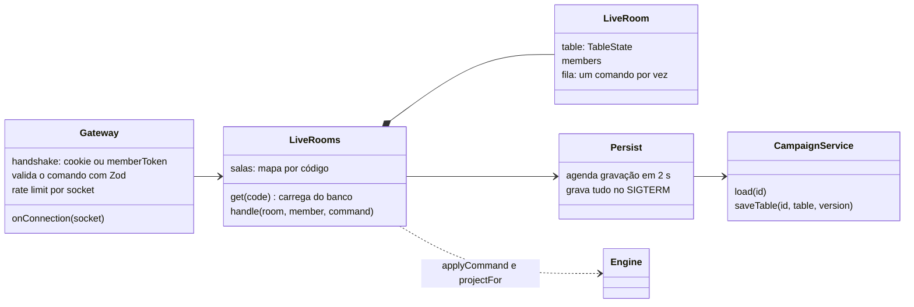

# 3. Arquitetura do código

## Pacotes (monorepo)



| Pacote | Contém | Pode importar |
| :-- | :-- | :-- |
| `@sgm/shared` | Schemas Zod: entidades, comandos, eventos, rotas HTTP | Só `zod` |
| `@sgm/engine` | `applyCommand`, `can`, `projectFor`. Sem I/O, sem `Date.now()`, sem `Math.random()` | `shared`, `immer` |
| `@sgm/web` | Telas, canvas, Dexie, conexão com o servidor | `shared`, `engine` |
| `@sgm/server` | HTTP, banco, auth, WebSocket | `shared`, `engine` |

O `dependency-cruiser` verifica essas setas no `npm run check`. Uma seta errada faz o CI falhar.

## A peça central: engine + RoomConnection

Esta é a ideia que faz os modos local e nuvem serem o mesmo app. A tela nunca sabe em qual modo está: ela lê o estado do `room-store` e manda comandos para uma `RoomConnection`.



`Result` é `{ ok: true, table, events }` ou `{ ok: false, code, message }`.

Por que isso importa:

- Uma regra existe num lugar só. Corrigiu no engine, corrigiu no modo local, no servidor e na previsão do cliente.
- O engine é testado sem navegador, sem rede e sem banco: é só chamar a função e comparar o resultado.
- Fim das funções `*FromRemote` de hoje, que existiam para evitar eco entre os stores e o socket.

## Cliente (`apps/web/src/`)

```
app/        providers, rotas, layout, error boundaries
routes/     arquivos de rota, finos (só montam features)
features/   uma pasta por funcionalidade: battlemap, tokens, zones, initiative,
            scenes, campaigns, room, auth, panel/(diary, notes, rules, tables, roulettes, soundpad)
room/       RoomConnection (local e remota), room-store, hooks
lib/        Dexie, mídia, cliente HTTP, utilitários
ui/         primitivos shadcn e componentes de domínio (StatBar, ElementBadge, TokenAvatar)
```

| Rota | Tela |
| :-- | :-- |
| `/` | Lista de campanhas (locais e da conta) |
| `/campanha/$id` | Mesa do mestre (local ou nuvem) |
| `/sala/$code` | Jogador na sala |
| `/tv/$code` | Só mapa e iniciativa, para a TV |
| `/entrar` | Login e cadastro |



Onde fica cada estado:

| Estado | Onde | Exemplo |
| :-- | :-- | :-- |
| Mesa | `room-store`, só por comandos | Posição de token, zonas |
| Painel do mestre | Store da feature, salvo direto | Diário, notas |
| Interface | `useState` ou store da feature | Ferramenta ativa, zoom, modal aberto |
| Dados HTTP | TanStack Query | Usuário logado, lista de campanhas da conta |

## Servidor (`apps/server/src/`)

```
main.ts      sobe o servidor, desliga com calma no SIGTERM
app.ts       buildApp(): Fastify com plugins e módulos (os testes usam)
env.ts       variáveis de ambiente validadas com Zod
plugins/     db, auth (Better Auth), security (helmet, cors, rate limit), static (serve o front)
modules/     auth, campaigns, rooms, media, health. Cada um: routes.ts + service.ts
realtime/    gateway.ts (socket, handshake, validação), live-rooms.ts (salas em memória,
             fila, projeção e envio), persist.ts (grava a mesa no banco)
db/          schema.ts (Drizzle), migrations/, client.ts
```



Só a camada `realtime/` é escrita à mão sobre o Socket.io. HTTP, auth e banco usam bibliotecas (Fastify, Better Auth, Drizzle).

## Protocolo do socket

```
cliente -> servidor   emit('cmd', { id, type, payload }, ack)
ack                   { ok: true, version } | { ok: false, code, message }
servidor -> cliente   'evt'      { version, type, payload, actorId, cmdId }
                      'snapshot' { version, table }
```

Nomes: comando `dominio.verbo` (`token.move`), evento no particípio (`token.moved`).

| Comando | Quem pode |
| :-- | :-- |
| `token.move` | Mestre, ou o jogador dono do token |
| `token.update` | Mestre. Jogador: só PV e condições do próprio token |
| `token.create`, `token.delete` | Mestre |
| `zone.*`, `marker.*`, `background.*`, `initiative.*`, `scene.*` | Mestre |
| `ping` | Todos. Não muda a versão |
