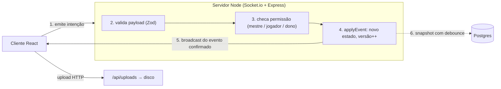

# Plano de Modernização Arquitetural — SGM v7

> Documento de referência para a equipe e para agentes de IA que trabalham no repositório. Substitui a versão anterior deste plano (que propunha core em Go, microsserviços e Redis/MinIO), revisada em 2026-09-24.

---

## 1. Objetivo

Deixar o SGM **robusto mas simples**: um único processo Node.js com Postgres, construído pela própria equipe, sem backend gerenciado (BaaS) e sem infraestrutura que não tenha uma necessidade medida.

A robustez vem do desenho do fluxo de dados (servidor como autoridade, contratos validados, estado persistido, testes), não da quantidade de serviços.

---

## 2. Decisões

| Decisão                                                                                                    | Motivo                                                                                                                                                                               |
| :--------------------------------------------------------------------------------------------------------- | :----------------------------------------------------------------------------------------------------------------------------------------------------------------------------------- |
| **Manter a stack atual** (React 19, Vite, TypeScript, Konva, Zustand, Dexie, Socket.io, Express, Postgres) | Todas as peças servem bem a um VTT. Os problemas encontrados são de arquitetura, não de tecnologia.                                                                                  |
| **Não reescrever o core em Go**                                                                            | A escala real (dezenas de conexões por sala) não justifica uma segunda linguagem. Os gargalos citados (Base64 de 20 MB e bcrypt travando o event loop) têm soluções baratas em Node. |
| **Não usar Supabase/Firebase**                                                                             | A equipe quer construir e entender auth, sincronização em tempo real e persistência.                                                                                                 |
| **Manter Socket.io** em vez de `ws` puro                                                                   | Já resolve reconexão, salas e acks. Os conceitos importantes (autoridade, validação, versionamento) são os mesmos nos dois.                                                          |
| **Sem Redis, MinIO, gateway ou microsserviços por enquanto**                                               | Só entram se houver gargalo medido. Uploads ficam em disco local.                                                                                                                    |
| **Sem migração completa para monorepo `packages/`**                                                        | Basta um pacote `shared/` para os contratos. O frontend continua em `src/`.                                                                                                          |

---

## 3. Diagnóstico (verificado no código)

### 3.1 Repositório

- A branch `feat/multiplayer-server` tem 4 commits locais que não estão no remoto.
- `origin/master` tem 12 commits que a branch ainda não recebeu.
- Os arquivos em `legacy/` estão deletados no disco mas não commitados.
- As pastas `client/` e `shared/` são órfãs (só `dist/`, `node_modules/` e `tsbuildinfo`). O `package.json` não tem `workspaces`, ao contrário do que dizia a antiga `ARCHITECTURE.md` (já substituída por `docs/architecture/`).
- O CI (`.github/workflows/ci.yml`) roda formatação, lint, typecheck e build. O projeto não tem nenhum teste.

### 3.2 Servidor multiplayer (`server/src/`)

O servidor só repassa eventos, sem arbitrar nada:

- **Sem permissão por papel**: qualquer membro da sala pode enviar `room:sync-state` e sobrescrever o mapa inteiro, ou apagar tokens, zonas e marcadores de qualquer um (`handlers/socketHandlers.ts`).
- **Sem validação de payload**: qualquer JSON de até 20 MB é aceito (`maxHttpBufferSize: 2e7` em `index.ts`).
- **Salas só em memória**: o `RoomManager` guarda tudo em um `Map`, então um restart derruba todas as sessões.
- **Imagens em Base64 pelo WebSocket**: mapas e tokens trafegam como Data URL, daí o buffer de 20 MB.
- **Tipos importados do frontend**: `roomManager.ts`, `index.ts` e `socketHandlers.ts` importam de `../../src/types/*`.
- **`bcryptjs`** é JavaScript puro e roda no thread principal, bloqueando todas as salas durante o hash.

### 3.3 Cliente (`src/`)

- `lib/saveHelpers.ts` importa os 14 stores e os stores chamam `triggerAutoSave()`: dependência circular que impede testar stores isoladamente.
- `store/useScenesStore.ts` mistura estado em memória, escrita no Dexie e eventos em `window`.
- Cada cliente aplica suas mudanças localmente e reemite pela rede. As funções `*FromRemote` (tokens, zonas, campanha, multiplayer) existem para evitar reemissão em loop.

### 3.4 Limpeza de dependências

- `better-sqlite3` está instalado e não é usado.
- `shadcn` é uma CLI e deve ir para `devDependencies`.
- `@types/express` está na v5 com `express` na v4.
- `shadcn` v4 e `tw-animate-css` pressupõem Tailwind v4, mas o projeto usa Tailwind v3.

---

## 4. Arquitetura Alvo

Resumo. A especificação completa (protocolo, modelo de dados, projeção por papel, segurança, falhas) está em [`../specs/system-design.md`](../specs/system-design.md). Em caso de divergência, vale o spec.



### 4.1 Contratos compartilhados (`shared/`)

- Um schema Zod por evento de socket (`token:move`, `zone:add`, `room:sync-state`...) e para as entidades (token, zona, marcador, cena, ficha).
- Os tipos TypeScript saem dos schemas com `z.infer`.
- Cliente e servidor importam de `shared/`. Nenhum import de `server/` para `src/`.

### 4.2 Servidor como autoridade

O núcleo é uma função pura, sem rede e sem banco:

```ts
applyEvent(state: RoomState, event: GameEvent, actor: Member): RoomState | Rejection
```

- Concentra as regras de permissão: jogador só move os próprios tokens; só o mestre sincroniza o mapa, cria zonas ou altera iniciativa.
- Cada evento aplicado incrementa `state.version`.
- Os handlers de socket ficam finos: validar, chamar `applyEvent`, transmitir o resultado ou responder a rejeição pelo ack.

### 4.3 Cliente: intenção e confirmação

- O cliente emite a intenção e aplica o evento confirmado que volta do servidor.
- Para interações contínuas (arrastar token), o cliente aplica localmente de forma otimista e reconcilia com o evento confirmado.
- As funções `*FromRemote` e o risco de reemissão em loop deixam de existir.

### 4.4 Autenticação e papéis no socket

- O token de sessão vai no handshake do Socket.io.
- Um middleware `io.use` identifica o usuário antes de qualquer evento.
- Cada membro da sala tem papel (`gm` ou `player`) e os tokens têm `ownerId`.

### 4.5 Persistência e reconexão

- Estado da sala em memória, salvo no Postgres como `jsonb` com debounce de poucos segundos e ao esvaziar a sala.
- No boot, as salas ativas são recarregadas do banco.
- Ao reconectar, o cliente recebe o snapshot completo da sala. Sincronização por deltas não é necessária nesta escala.
- O Dexie continua como armazenamento local offline-first do mestre.

### 4.6 Uploads de imagem

- `POST /api/uploads` com `multer`, salvando em `uploads/` com o hash do conteúdo como nome (evita duplicatas).
- Arquivos servidos como estáticos. O WebSocket transporta só a URL.
- `maxHttpBufferSize` cai de 20 MB para cerca de 100 KB.

---

## 5. Fases de Execução

Cada fase termina com CI verde e pode ser entregue em um PR próprio.

### Fase 0 — Alinhamento do repositório

- [x] Commitar a remoção de `legacy/` (ou restaurar, se ainda for necessária).
- [x] Trazer os 12 commits de `origin/master` para `feat/multiplayer-server` e resolver conflitos.
- [x] Publicar a branch no remoto.
- [x] Remover as pastas órfãs `client/` e `shared/` antigas.
- [x] Limpeza de dependências da seção 3.4 (exceto a migração para Tailwind v4, que fica para depois).

### Fase 1 — Testes e contratos

- [ ] Instalar Vitest (e `fake-indexeddb` para o cliente) e adicionar `npm test` ao CI.
- [ ] Criar `shared/` com os schemas Zod dos eventos e entidades existentes.
- [ ] Trocar os imports `../../src/types/*` do servidor por `shared/`.
- [ ] Error boundary na raiz do app e em cada subpainel do mestre, para um erro de render não derrubar a aplicação inteira.
- [ ] Reordenar a escala de z-index (dialogs acima do painel do mestre) e remover o overlay manual do `AddMusicModal` (ver `docs/architecture/frontend-guidelines.md`, seção 3).

### Fase 2 — Servidor como autoridade

- [ ] Implementar `applyEvent` com testes, começando por tokens e permissões.
- [ ] Autenticação no handshake e papéis `gm` / `player` na sala.
- [ ] Handlers passam a validar com Zod e aplicar via `applyEvent`.
- [ ] Trocar `bcryptjs` por `bcrypt`.

### Fase 3 — Cliente no modelo intenção/confirmação

- [ ] Stores emitem intenções e aplicam apenas eventos confirmados.
- [ ] Atualização otimista para arrasto de tokens.
- [ ] Remover as funções `*FromRemote`.

### Fase 4 — Persistência de salas

- [ ] Tabela de salas no Postgres com snapshot `jsonb` e versão.
- [ ] Snapshot com debounce e recarga no boot.
- [ ] Reconexão com envio de snapshot completo.

### Fase 5 — Uploads de imagem

- [ ] Endpoint `/api/uploads` com armazenamento em disco por hash.
- [ ] Cliente passa a enviar URLs em vez de Base64.
- [ ] Reduzir `maxHttpBufferSize`.

### Fase 6 — Desacoplamento do autosave

- [ ] Substituir `triggerAutoSave()` dentro dos stores por `subscribe` do Zustand (ou middleware) registrado em um único ponto.
- [ ] Isolar o acesso ao Dexie de `useScenesStore` em um módulo de persistência.
- [ ] Testes dos stores sem Dexie.

### Fase 7 — Design system

Especificação completa em [`../specs/ui-design-system.md`](../specs/ui-design-system.md). Pode rodar em paralelo às fases 2 a 6, em PRs separados.

- [ ] Migrar para Tailwind v4 e criar os tokens (cores, tipografia, z-index, movimento) em CSS e em `src/styles/tokens.ts`.
- [ ] Completar o inventário de componentes de `src/components/ui/` e os componentes de domínio, com Storybook.
- [ ] Guarda no CI contra hexadecimal, tamanho e z-index arbitrários e `alert`/`confirm`/`prompt`.
- [ ] Error boundaries nas regiões restantes (a raiz e os subpainéis do mestre entram na Fase 1).
- [ ] Layout responsivo nas faixas compacta, média e ampla, com `ResponsivePanel`.
- [ ] Migrar as telas para tokens e primitivos, uma área por PR (mapa e toolbar, sidebars, modais, painel do mestre).
- [ ] Screenshots de referência no Playwright nos três tamanhos de tela.

### Depois (sem data)

- `docker-compose` com Postgres para desenvolvimento local e o deploy descrito em [`../specs/system-design.md`](../specs/system-design.md), seção 12.
- Observabilidade (seção 11 do system design), log de eventos para replay, QR code e modo espectador.

---

## 6. Execução por Agentes de IA

As regras gerais estão em [`/AGENTS.md`](../../AGENTS.md) e as decisões em [`../decisions/`](../decisions/). Ao executar este plano:

1. **Uma fase por vez, um PR por fase.** Não comece a fase seguinte sem a anterior revisada e aceita.
2. **Leia antes de mexer**: o documento de `docs/architecture/` da área afetada e as decisões 0001 a 0003.
3. **Sem desvio de escopo**: não introduza biblioteca fora da [decisão 0004](../decisions/0004-stack-definida.md) e não antecipe itens de fases futuras. Se algo do plano não fizer sentido diante do código, pare e explique em vez de improvisar.
4. **Mantenha a documentação viva**: marque os checkboxes concluídos aqui e atualize o `docs/architecture/` correspondente no mesmo PR.
5. **Ao terminar a Fase 1**, adicione `npm test` à tabela de comandos e à verificação obrigatória do `AGENTS.md`.
6. **Ao terminar a Fase 3**, substitua a seção "Multiplayer (estado de transição)" do `AGENTS.md` pela regra do novo modelo: todo evento novo exige schema em `shared/` e caso em `applyEvent` com teste.

---

## 7. Definition of Done

1. `format:check`, `lint`, `typecheck`, `test` e `build` passando.
2. Todo evento de socket novo ou alterado tem schema em `shared/` e teste em `applyEvent`, incluindo o caso de permissão negada.
3. Nenhum import do servidor para `src/` ou do cliente para `server/`.
4. Nenhuma imagem trafegando em Base64 pelo WebSocket.

---

## 8. Fora de Escopo

- Core em Go, Redis, MinIO, gateway Nginx/Caddy, publicação de imagens em registry.
- Backend gerenciado (Supabase, Firebase).
- Sincronização por CRDT (Yjs). Reavaliar só se edição offline com merge virar requisito.
- Importação de fichas por OCR/LLM: registrada em [`roadmap-features.md`](roadmap-features.md), seção 8.
