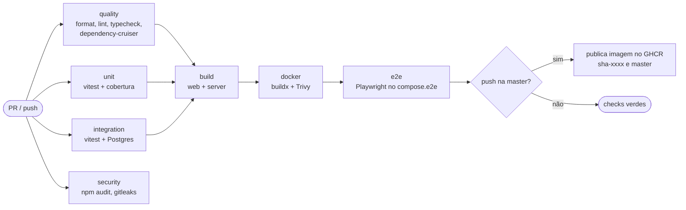

# CI/CD e Infraestrutura — SGM

> Especificação de containers, pipelines e deploy. Stack em [0006](../decisions/0006-stack-revisada.md), estrutura de pastas em [`code-architecture.md`](code-architecture.md), comportamento em runtime em [`system-design.md`](system-design.md).

**Branches (GitHub Flow, decisão 0008):** até a v8 substituir a v7, tudo deste documento roda na `next`. Onde estiver escrito `master`, leia `next`. A `master` (v7 do Pedro) mantém o CI atual até lá. Release, tags e produção só começam depois da v8 entrar na `master`.

---

## 1. Objetivos

1. Nada chega na `master` sem passar por qualidade, testes, E2E e segurança.
2. Todo merge na `master` gera uma imagem Docker versionada e vai sozinho para o ambiente de **staging**.
3. **Produção** só recebe versões marcadas como release e com aprovação manual.
4. Deploy com migração de banco, health check e rollback automático se a nova versão não subir.
5. O ambiente local sobe com um comando e é igual ao do CI.

---

## 2. Ambientes

| Ambiente     | Quando atualiza               | URL                 | Dados                          |
| :----------- | :---------------------------- | :------------------ | :----------------------------- |
| Local        | `npm run dev`                 | `localhost`         | Postgres do `compose.dev.yaml` |
| CI (efêmero) | Cada PR                       | —                   | Postgres descartável do job    |
| Staging      | Merge na `master`             | `staging.<domínio>` | Banco próprio, pode ser zerado |
| Produção     | Release publicada + aprovação | `<domínio>`         | Banco com backup diário        |

Configuração por variáveis de ambiente, validadas no boot (`apps/server/src/config/env.ts`). Segredos só em GitHub Environments (`staging`, `production`) e no `.env` do servidor. Nunca no repositório. `.env.example` na raiz documenta todas as variáveis.

---

## 3. Containers

### 3.1 Imagem da aplicação (`infra/docker/Dockerfile`)

Uma imagem só, com o servidor Fastify servindo também o build estático do cliente: uma origem, sem CORS e sem problema de cookie.

| Estágio     | Base                    | Faz                                                                              |
| :---------- | :---------------------- | :------------------------------------------------------------------------------- |
| `deps`      | `node:24-bookworm-slim` | `npm ci` com cache de montagem do BuildKit                                       |
| `build`     | `deps`                  | Build de `packages/*`, `apps/web` e `apps/server`                                |
| `prod-deps` | `node:24-bookworm-slim` | `npm ci --omit=dev --workspace @sgm/server` (inclui o binário nativo do `sharp`) |
| `runtime`   | `node:24-bookworm-slim` | Copia `prod-deps`, o build do servidor, o build do web e as migrações            |

Regras da imagem de runtime:

- Usuário não root (`node`).
- `NODE_ENV=production`, `tini` como init para repassar o `SIGTERM` e o servidor fazer o shutdown gracioso.
- `HEALTHCHECK` chamando `/healthz`.
- Sem ferramentas de build, sem código-fonte TypeScript, sem `.env`.
- Labels OCI (`org.opencontainers.image.source`, `revision`, `version`).
- Mesma imagem roda o servidor (`node dist/main.js`) e as migrações (`node dist/migrate.js`).

`.dockerignore` exclui `node_modules`, `dist`, `.git`, `docs`, `e2e` e arquivos de ambiente.

### 3.2 Compose

| Arquivo                           | Serviços                                        | Uso                                                       |
| :-------------------------------- | :---------------------------------------------- | :-------------------------------------------------------- |
| `infra/compose/compose.dev.yaml`  | `postgres` (17, com healthcheck e volume)       | Desenvolvimento: o app roda fora do Docker com hot reload |
| `infra/compose/compose.e2e.yaml`  | `postgres`, `migrate`, `app` (imagem do PR)     | Playwright no CI e localmente                             |
| `infra/compose/compose.prod.yaml` | `caddy`, `migrate`, `app`, `postgres`, `backup` | Staging e produção                                        |

Produção:

```
VPS
└── compose.prod.yaml
    ├── caddy     TLS automático (Let's Encrypt), proxy reverso para app, compressão, headers de segurança
    ├── migrate   roda uma vez antes do app: drizzle migrate (sai com erro se falhar)
    ├── app       imagem ghcr.io/<org>/sgm:<versão>, uma instância (salas ficam em memória, ver system design)
    ├── postgres  volume persistente, sem porta exposta para fora
    └── backup    pg_dump diário com retenção de 7 diários e 4 semanais, cópia para armazenamento externo
```

Volume `media` montado no `app` em `/data/media` e incluído no backup.

---

## 4. Pipelines (GitHub Actions)

### 4.1 `ci.yml` — em todo PR e push na `master`



| Job           | O que roda                                                                                                                                                                 | Falha se                                                                                     |
| :------------ | :------------------------------------------------------------------------------------------------------------------------------------------------------------------------- | :------------------------------------------------------------------------------------------- |
| `quality`     | `format:check`, `lint`, `typecheck` e `depcruise` em todos os workspaces                                                                                                   | Qualquer erro ou violação de fronteira                                                       |
| `unit`        | `vitest run --coverage` em todos os workspaces                                                                                                                             | Teste falha ou cobertura abaixo do mínimo (`@sgm/engine` 90%, `@sgm/shared` 80%, demais 60%) |
| `integration` | Testes de `apps/server/test/integration` com Postgres como service container e migrações aplicadas                                                                         | Teste falha                                                                                  |
| `security`    | `npm audit --audit-level=high --omit=dev`, `gitleaks`                                                                                                                      | Vulnerabilidade alta ou segredo no diff                                                      |
| `build`       | Build de todos os workspaces, upload dos artefatos                                                                                                                         | Erro de build                                                                                |
| `docker`      | `docker buildx build` com cache do GitHub Actions, scan com Trivy                                                                                                          | Vulnerabilidade crítica com correção disponível                                              |
| `e2e`         | Sobe `compose.e2e.yaml` com a imagem do job anterior e roda Playwright: roteiro de fumaça, dois navegadores na mesma sala, viewport de celular e screenshots de referência | Teste falha ou diferença visual acima do limite. Traces e vídeos anexados como artefato      |
| `publish`     | Só na `master`: push da imagem para o GHCR com tags `sha-<curto>` e `master`                                                                                               | —                                                                                            |

Regras gerais do workflow:

- `concurrency` por branch, cancelando execuções antigas do mesmo PR.
- Node pela `.nvmrc`, cache do npm pelo `package-lock.json`.
- Permissões mínimas por job (`contents: read`; `packages: write` só no `publish`).
- Actions fixadas por versão maior (`actions/checkout@v4`) e atualizadas pelo Dependabot.
- Tempo total alvo do PR: menos de 15 minutos.

### 4.2 `pr-title.yml`

Valida que o título do PR segue Conventional Commits (`feat(tokens): ...`). O merge é sempre squash, então o título vira a mensagem do commit na `master` e alimenta o changelog.

### 4.3 `codeql.yml`

Análise estática de segurança do GitHub (JavaScript/TypeScript) em PRs e semanalmente.

### 4.4 `release.yml` — `release-please`

- Mantém um PR de release aberto, com a próxima versão (SemVer) e o `CHANGELOG.md` gerados a partir dos commits.
- Ao fazer merge desse PR, cria a tag `vX.Y.Z` e a release no GitHub.
- A release retagueia a imagem `sha-<commit>` já testada como `vX.Y.Z` e `latest`. Não há rebuild: produção roda exatamente o que passou no CI.

### 4.5 `deploy.yml`

| Gatilho                                    | Ambiente     | Aprovação                                          |
| :----------------------------------------- | :----------- | :------------------------------------------------- |
| `ci.yml` concluído com sucesso na `master` | `staging`    | Automática                                         |
| Release publicada                          | `production` | Manual (revisor obrigatório no GitHub Environment) |
| Manual (`workflow_dispatch` com a versão)  | Qualquer     | Conforme o ambiente. Usado para rollback           |

Passos do deploy (via SSH no VPS, chave em segredo do ambiente):

1. `docker compose pull` da versão alvo.
2. Guarda a versão que está rodando como `PREVIOUS_VERSION`.
3. `docker compose run --rm migrate`. Se falhar, para aqui sem tocar no app.
4. `docker compose up -d app`.
5. Espera `/readyz` responder 200, até 60 s.
6. Se não responder: volta para `PREVIOUS_VERSION`, marca o deploy como falho e notifica.
7. Smoke test pós-deploy: requisição a `/healthz`, `/readyz` e à página inicial.

Migrações precisam ser compatíveis com a versão anterior do app durante o passo 4 (adicionar antes de remover). Enquanto vale a decisão 0005, isso só é exigido em produção.

### 4.6 Dependabot (`.github/dependabot.yml`)

Semanal para `npm`, `github-actions` e `docker`, com atualizações de patch e minor agrupadas num PR só por ecossistema. Majors em PRs separados.

---

## 5. Regras do repositório

- `master` e `next` protegidas: só por PR, com os checks de `ci.yml`, `pr-title.yml` e `codeql.yml` verdes, histórico linear (squash) e sem force push nem exclusão.
- Sem aprovação obrigatória: com duas pessoas, o GitHub não deixa aprovar o próprio PR. Revisão do outro é bem-vinda, não bloqueante.
- Templates em `.github/`: PR (o que mudou, como foi testado, screenshots se for UI, fase do plano) e issues (bug e feature).
- `CODEOWNERS` com os responsáveis por `packages/engine`, `apps/server/src/realtime` e `infra/`.

---

## 6. Scripts da raiz

| Script                                                | Faz                                                                                       |
| :---------------------------------------------------- | :---------------------------------------------------------------------------------------- |
| `npm run dev`                                         | Sobe o Postgres do `compose.dev.yaml`, aplica migrações e roda web e server em modo watch |
| `npm run build`                                       | Build de todos os workspaces na ordem de dependência                                      |
| `npm run test`                                        | Testes de unidade de todos os workspaces                                                  |
| `npm run test:integration`                            | Testes de integração do servidor (exige Postgres)                                         |
| `npm run test:e2e`                                    | Sobe `compose.e2e.yaml` e roda o Playwright                                               |
| `npm run lint`, `typecheck`, `format`, `format:check` | Em todos os workspaces                                                                    |
| `npm run depcruise`                                   | Verifica as regras de dependência                                                         |
| `npm run db:generate`, `db:migrate`                   | Gera e aplica migrações do Drizzle                                                        |
| `npm run check`                                       | Tudo que o job `quality` e `unit` rodam, para usar antes de abrir PR                      |
