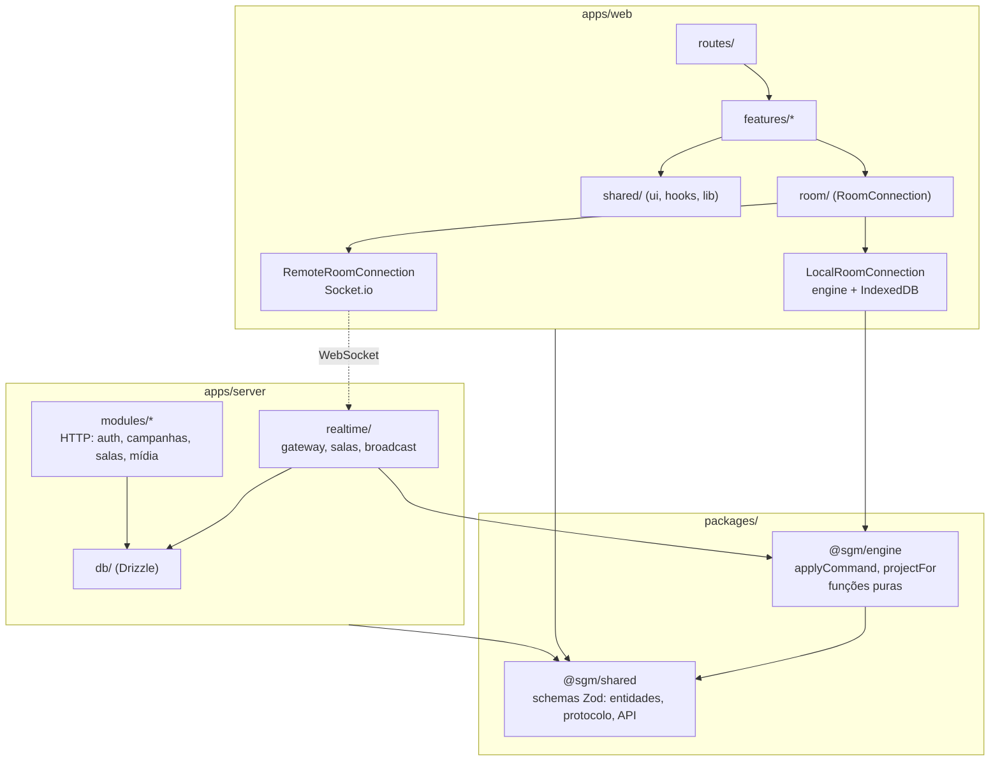
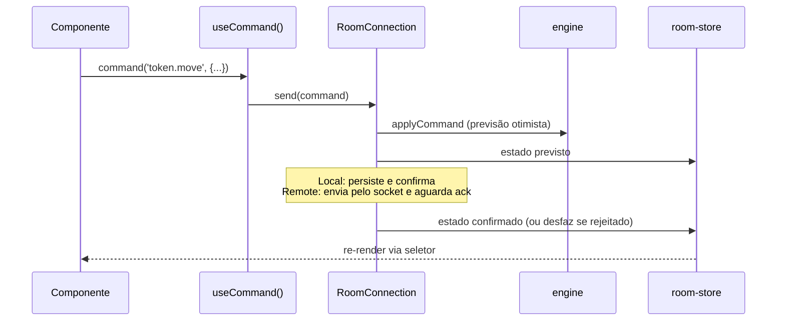

# Arquitetura de Código — SGM

> Estrutura alvo do repositório: pacotes, camadas, fronteiras e regras de dependência. Complementa o [system design](system-design.md), que descreve o comportamento em tempo de execução. Stack em [0006](../decisions/0006-stack-revisada.md), decisão da arquitetura em [0007](../decisions/0007-arquitetura-engine-compartilhada.md).

---

## 1. Princípios

1. **Uma regra de jogo, um lugar.** Toda regra (quem pode mover o quê, o que um comando faz, o que cada papel enxerga) vive no pacote `engine`, em funções puras. Servidor e cliente executam o mesmo código.
2. **Offline e online são o mesmo fluxo.** A interface envia comandos para uma `RoomConnection`. Offline, a conexão roda o `engine` no próprio navegador e salva no IndexedDB. Online, envia pelo socket e o servidor roda o mesmo `engine`. A interface não sabe qual das duas está ativa.
3. **Organização por funcionalidade, não por tipo de arquivo.** Tudo sobre zonas fica em `features/zones/`, e não espalhado entre `components/`, `store/` e `types/`.
4. **Dependências numa direção só**, verificadas no CI (seção 6).
5. **Contratos antes de código.** Entidades, comandos, eventos e rotas HTTP são schemas Zod em `packages/shared`. Os tipos TypeScript saem deles.

---

## 2. Visão geral



---

## 3. Estrutura do repositório

```
sgm/
├── package.json              npm workspaces, scripts que rodam em todos os pacotes
├── tsconfig.base.json        opções comuns (strict, paths)
├── .nvmrc                    versão do Node
├── apps/
│   ├── web/                  @sgm/web     SPA React
│   └── server/               @sgm/server  Fastify + Socket.io
├── packages/
│   ├── shared/               @sgm/shared  contratos
│   └── engine/               @sgm/engine  regras do jogo
├── infra/
│   ├── docker/               Dockerfile, Caddyfile
│   └── compose/              compose.dev.yaml, compose.e2e.yaml, compose.prod.yaml
├── .github/                  workflows, dependabot, templates de PR e issue
└── docs/
```

### 3.1 `packages/shared` (`@sgm/shared`)

```
src/
├── domain/          token.ts, zone.ts, marker.ts, background.ts, initiative.ts, campaign.ts, member.ts
├── protocol/        commands.ts, events.ts, errors.ts, envelope.ts
├── api/             schemas das rotas HTTP (request e response) por módulo
├── constants/       limites (tamanho de payload, membros por sala), alfabeto do código de sala
└── index.ts         exporta tudo
```

- Só depende de `zod`. Nada de React, Node, Socket.io ou banco.
- Cada arquivo exporta o schema e o tipo: `export const Token = z.object({...}); export type Token = z.infer<typeof Token>;`
- Limites de tamanho de strings e arrays ficam nos schemas: são a primeira defesa do servidor.

### 3.2 `packages/engine` (`@sgm/engine`)

```
src/
├── state.ts         RoomState e createEmptyRoom()
├── apply.ts         applyCommand(state, command, actor) -> { state, events } | Rejection
├── commands/        um arquivo por grupo: tokens.ts, zones.ts, markers.ts, backgrounds.ts, initiative.ts
├── permissions.ts   can(actor, command, state): boolean
├── project.ts       projectFor(state, member) e projectEvent(event, member, state)
└── index.ts
```

- Depende só de `@sgm/shared`. Sem I/O, sem `Date.now()`, sem `Math.random()`: tempo e ids entram como parâmetro, então a mesma entrada sempre gera a mesma saída.
- Estado imutável (retorna um estado novo). Pode usar `immer` internamente.
- Cobertura de testes mínima de 90% de linhas, verificada no CI.

### 3.3 `apps/server` (`@sgm/server`)

```
src/
├── main.ts               sobe o servidor e trata SIGTERM (shutdown gracioso)
├── app.ts                buildApp(): cria o Fastify e registra plugins e módulos (usado também nos testes)
├── config/               env.ts: variáveis de ambiente validadas com Zod, falha no boot se faltar alguma
├── plugins/              db, auth, cors, helmet, rate-limit, static, sensible
├── modules/
│   ├── auth/             configuração do Better Auth e montagem em /api/auth/*
│   ├── campaigns/        routes.ts, service.ts, repository.ts
│   ├── rooms/            criar e fechar sala (HTTP)
│   ├── media/            upload e entrega de imagens
│   └── health/           /healthz, /readyz, /metrics
├── realtime/             camada de WebSocket, escrita à mão sobre Socket.io
│   ├── gateway.ts        cria o Socket.io sobre o servidor HTTP do Fastify, handshake, rate limit, roteia comandos
│   ├── handshake.ts      resolve usuário (sessão do Better Auth) ou convidado (memberToken)
│   ├── room-registry.ts  salas em memória, fila de comandos por sala, carga sob demanda e descarga
│   ├── broadcaster.ts    envia a cada membro o evento projetado (projectEvent)
│   └── room-store.ts     snapshot com debounce e log de eventos no Postgres
├── db/
│   ├── schema/           tabelas Drizzle, um arquivo por domínio
│   ├── migrations/       geradas pelo drizzle-kit
│   └── client.ts
└── observability/        logger (pino), métricas (prom-client)
test/
├── integration/          servidor real em porta efêmera + Postgres do compose de teste
└── helpers/
```

Camadas de um módulo HTTP: `routes.ts` (valida com schemas de `@sgm/shared/api`, chama o service) → `service.ts` (regra da aplicação) → `repository.ts` (única camada que fala com o Drizzle). Rotas não acessam o banco direto.

### 3.4 `apps/web` (`@sgm/web`)

```
src/
├── main.tsx
├── app/
│   ├── providers.tsx         QueryClient, Router, Toaster, tema
│   ├── router.tsx
│   ├── error-boundary.tsx
│   └── layout/               AppShell, Header, Footer (sem regra de negócio)
├── routes/                   rotas do TanStack Router, finas: só compõem features
│   ├── index.tsx             mesa local (modo offline do mestre)
│   ├── sala.$code.tsx        entrar numa sala
│   ├── tv.$code.tsx          modo espectador
│   └── login.tsx
├── features/
│   ├── battlemap/            stage Konva, camadas, ferramentas, coordenadas
│   ├── tokens/               lista, criação, ficha, condições
│   ├── zones/                lista, editor de zona, POIs, marcadores
│   ├── initiative/
│   ├── scenes/
│   ├── campaign/             slots de save, abrir e salvar campanha
│   ├── room/                 criar e entrar em sala, membros, status da conexão
│   ├── auth/
│   ├── master-panel/         só o contêiner e o layout de colunas
│   ├── notes/  diary/  rules/  tables/  roulettes/  soundpad/
│   └── (cada feature)
│       ├── components/
│       ├── hooks/
│       ├── store.ts          estado de UI da feature (Zustand), se precisar
│       ├── api.ts            queries e mutations HTTP (TanStack Query), se precisar
│       ├── model.ts          lógica pura da feature, testável sem React
│       └── index.ts          API pública: o que outras partes podem importar
├── room/                     infraestrutura da sala
│   ├── connection.ts         interface RoomConnection
│   ├── local-connection.ts   roda @sgm/engine no navegador e persiste no IndexedDB
│   ├── remote-connection.ts  Socket.io: envia comandos, recebe eventos, otimismo, lacuna de versão
│   ├── room-store.ts         estado da sala visto pela UI (Zustand), alimentado pela conexão
│   └── hooks.ts              useRoom(selector), useCommand()
├── persistence/
│   ├── db.ts                 Dexie
│   ├── campaigns-repo.ts
│   └── media-repo.ts         imagens local:<hash> como Blob
├── shared/
│   ├── ui/                   primitivos shadcn (antigo src/components/ui)
│   ├── components/           componentes de domínio reutilizáveis: ElementBadge, StatBar, TokenAvatar
│   ├── hooks/
│   ├── lib/                  api-client, utils
│   └── styles/               tokens.css, tokens.ts
└── test/                     setup do Vitest
e2e/                          Playwright
.storybook/
```

#### Como os dados fluem no cliente



- **Estado da sala** (tokens, zonas, marcadores, fundos, iniciativa) existe **só** no `room-store`. Features leem com `useRoom(selector)` e alteram com `useCommand()`. Nenhuma feature guarda cópia desse estado.
- **Estado de UI** (ferramenta ativa, seleção, painel aberto, zoom) fica no `store.ts` da feature ou em `useState`.
- **Dados HTTP** (usuário, lista de campanhas) ficam no cache do TanStack Query, nunca num store Zustand.
- O autosave acaba como conceito: a `LocalRoomConnection` persiste a cada comando confirmado (com debounce), e a remota não persiste nada localmente além do cache de sessão.

---

## 4. De onde vem cada coisa hoje

| Hoje                                                                          | Alvo                                                                         |
| :---------------------------------------------------------------------------- | :--------------------------------------------------------------------------- |
| `src/canvas/*`                                                                | `apps/web/src/features/battlemap/`                                           |
| `src/components/tokens/`, `modals/TokenCreateModal`, `modals/TokenSheetModal` | `features/tokens/`                                                           |
| `modals/ZoneMarkerModal`, partes de `sidebar/SidebarLeft`                     | `features/zones/`                                                            |
| `components/initiative/`, `modals/Initiative*`                                | `features/initiative/`                                                       |
| `components/master-panel/<sub>/`                                              | `features/<sub>/` (notes, diary, rules, tables, roulettes, soundpad, scenes) |
| `components/master-panel/` (contêiner)                                        | `features/master-panel/`                                                     |
| `components/layout/`                                                          | `app/layout/`                                                                |
| `components/sidebar/`                                                         | Dividido entre `app/layout/` (contêiner) e as features do conteúdo           |
| `modals/AuthModal`                                                            | `features/auth/`                                                             |
| `modals/MultiplayerModal`                                                     | `features/room/`                                                             |
| `modals/Save/LoadCampaignModal`                                               | `features/campaign/`                                                         |
| `components/ui/`                                                              | `shared/ui/`                                                                 |
| `lib/db.ts`                                                                   | `persistence/db.ts`                                                          |
| `lib/saveHelpers.ts`                                                          | Deixa de existir (persistência pela `LocalRoomConnection`)                   |
| `lib/socket.ts`, `store/useMultiplayerStore`                                  | `room/remote-connection.ts`                                                  |
| `lib/spotify*`                                                                | `features/soundpad/lib/`                                                     |
| `store/useTokenStore`, `useZoneStore`, parte de `useCampaignStore`            | `room/room-store.ts` + regras em `@sgm/engine`                               |
| Demais `store/use*Store`                                                      | `features/<nome>/store.ts`                                                   |
| `src/types/game.ts`, `multiplayer.ts`                                         | `packages/shared/src/domain/` e `protocol/`                                  |
| Demais `src/types/*`                                                          | `features/<nome>/model.ts` ou `packages/shared` se o servidor precisar       |
| `server/src/index.ts`                                                         | `apps/server/src/main.ts` e `app.ts`                                         |
| `server/src/roomManager.ts`, `handlers/socketHandlers.ts`                     | `apps/server/src/realtime/` + `@sgm/engine`                                  |
| `server/src/routes/authRoutes.ts`, `services/authService.ts`                  | `modules/auth/` com Better Auth                                              |
| `server/src/db/db.ts`                                                         | `apps/server/src/db/` com Drizzle                                            |

---

## 5. Convenções

| Item                  | Convenção                                                                                               |
| :-------------------- | :------------------------------------------------------------------------------------------------------ |
| Pastas e arquivos     | `kebab-case` (`room-store.ts`, `token-sheet.tsx`)                                                       |
| Componentes React     | `PascalCase` no nome exportado, um componente público por arquivo                                       |
| Hooks                 | `useAlgo`, em `hooks/` da feature                                                                       |
| Schemas Zod           | `PascalCase`, mesmo nome do tipo (`Token`, `MoveTokenCommand`)                                          |
| Comandos e eventos    | `dominio.verbo` no imperativo para comandos (`token.move`) e no particípio para eventos (`token.moved`) |
| Testes                | Ao lado do arquivo: `apply.test.ts`. Integração em `apps/server/test/`, E2E em `apps/web/e2e/`          |
| Stories               | Ao lado do componente: `button.stories.tsx`                                                             |
| Imports entre pacotes | Pelo nome (`@sgm/shared`), nunca por caminho relativo (`../../packages/...`)                            |
| Imports dentro do web | Alias `@/` para `apps/web/src/`                                                                         |
| Exports               | Nomeados. Sem `export default`, exceto onde a ferramenta exige (config, rotas se necessário)            |
| Tamanho               | Arquivo com mais de 300 linhas é dividido                                                               |

---

## 6. Regras de dependência

Verificadas no CI com `dependency-cruiser`. Violação falha o build.

| De                 | Pode importar                                                  | Não pode importar                             |
| :----------------- | :------------------------------------------------------------- | :-------------------------------------------- |
| `@sgm/shared`      | `zod`                                                          | Qualquer outro pacote do projeto, React, Node |
| `@sgm/engine`      | `@sgm/shared`, `immer`                                         | React, Node, Socket.io, banco, qualquer I/O   |
| `apps/server`      | `@sgm/shared`, `@sgm/engine`                                   | `apps/web`                                    |
| `apps/web`         | `@sgm/shared`, `@sgm/engine`                                   | `apps/server`                                 |
| `web/routes`       | `features/*/index.ts`, `app/`, `shared/`                       | Arquivos internos de features                 |
| `web/features/X`   | `room/`, `persistence/`, `shared/`, `features/Y/index.ts`      | Arquivos internos de `features/Y`             |
| `web/shared`       | Bibliotecas externas                                           | `features/`, `room/`, `routes/`               |
| `web/room`         | `@sgm/engine`, `persistence/`, `shared/lib`                    | `features/`                                   |
| `server/modules/X` | `db/`, `plugins/`, `observability/`, `modules/Y/service.ts`    | `repository.ts` de outro módulo, `realtime/`  |
| `server/realtime`  | `@sgm/engine`, `db/`, `modules/*/service.ts`, `observability/` | `modules/*/routes.ts`                         |

Também são proibidos ciclos de import em qualquer pacote.
