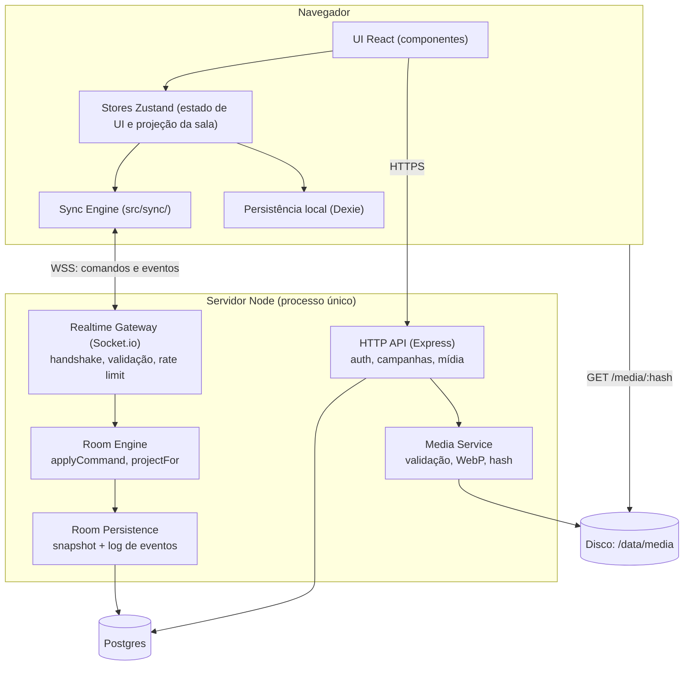
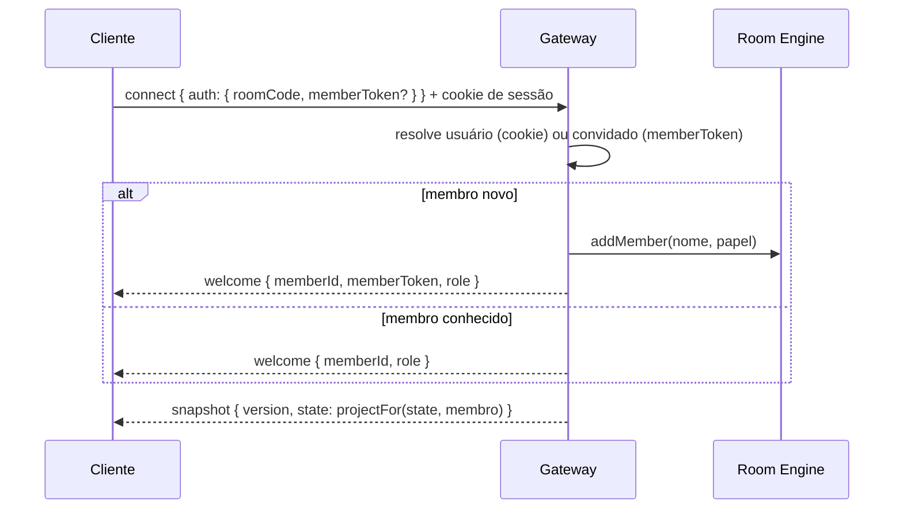
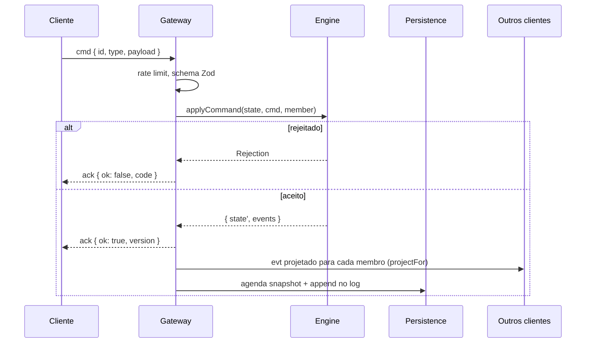

# System Design — SGM

> Especificação do sistema alvo. O estado atual está em [`../architecture/`](../architecture/) e a ordem de execução em [`../plans/modernizacao-arquitetural.md`](../plans/modernizacao-arquitetural.md). Decisões de base: [0001](../decisions/0001-manter-stack-node.md), [0002](../decisions/0002-backend-proprio-sem-baas.md), [0003](../decisions/0003-servidor-autoritativo.md).

---

## 1. Requisitos

### 1.1 Funcionais

| ID  | Requisito                                                                                                                      |
| :-- | :----------------------------------------------------------------------------------------------------------------------------- |
| F1  | O mestre prepara a campanha offline (mapa, tokens, zonas, fichas, notas) sem precisar de servidor.                             |
| F2  | O mestre abre uma sala e os jogadores entram por código ou QR code, **sem criar conta**.                                       |
| F3  | Todos veem o mapa, os tokens e a iniciativa em tempo real.                                                                     |
| F4  | Jogadores movem apenas os próprios tokens. Só o mestre cria, edita e apaga zonas, marcadores, fundos e ameaças.                |
| F5  | Informações secretas do mestre (itens com `isRevealed: false`, fichas de ameaças) **nunca chegam** ao navegador dos jogadores. |
| F6  | Quem cai e reconecta volta para a mesma sala, com a mesma identidade e o mesmo papel.                                          |
| F7  | Uma sessão sobrevive a restart ou deploy do servidor.                                                                          |
| F8  | Pings no mapa visíveis para todos.                                                                                             |
| F9  | Mapas e retratos são enviados uma vez e reaproveitados.                                                                        |
| F10 | Histórico de eventos da sessão (base para resumo e replay futuros).                                                            |

### 1.2 Não funcionais

| ID  | Requisito                                                | Meta                                                                                                     |
| :-- | :------------------------------------------------------- | :------------------------------------------------------------------------------------------------------- |
| N1  | Latência de um movimento de token até os outros clientes | p95 < 150 ms pela internet, < 50 ms em rede local                                                        |
| N2  | Perda máxima de dados se o servidor cair                 | 2 segundos de eventos                                                                                    |
| N3  | Tempo para um jogador entrar e ver o mapa                | < 3 s com o mapa já em cache, < 8 s na primeira vez em 4G                                                |
| N4  | Mesa típica                                              | 1 mestre e 2 a 8 jogadores. Limite de 20 membros por sala                                                |
| N5  | Dispositivos                                             | Mestre: desktop ou tablet. Jogadores: celular, tablet ou desktop. Tela de TV/projetor como espectador    |
| N6  | Operação                                                 | Um servidor pequeno (1 vCPU, 1 GB) atende a demanda inicial. Deploy sem derrubar sessões por mais de 5 s |

### 1.3 Fora de escopo

Escala horizontal com várias instâncias, edição offline simultânea com merge (CRDT), voz e vídeo, marketplace de conteúdo.

---

## 2. Estimativa de capacidade

| Item                            | Estimativa                                                                                                                                      |
| :------------------------------ | :---------------------------------------------------------------------------------------------------------------------------------------------- |
| Estado de uma sala sem imagens  | 50 tokens × ~2 KB + 100 zonas × ~5 KB + marcadores ≈ **0,6 MB** no pior caso, tipicamente < 150 KB                                              |
| Imagens por campanha            | 5 a 30 arquivos de 0,2 a 3 MB depois de convertidos para WebP                                                                                   |
| Tráfego durante arrasto         | 1 cliente arrastando a 20 Hz × 8 destinatários = 160 msg/s de ~80 bytes, cerca de 13 KB/s                                                       |
| Tráfego em combate normal       | < 5 comandos/s por sala                                                                                                                         |
| Salas simultâneas por instância | Centenas. O gargalo real é CPU de serialização JSON, desprezível sem Base64                                                                     |
| Snapshot no Postgres            | 1 escrita a cada 2 s por sala ativa com mudanças, ~150 KB. 100 salas ativas ≈ 7,5 MB/s no pior caso, na prática bem menos por causa do debounce |

Conclusão: um processo Node sobra. O único risco real de desempenho é trafegar imagens pelo socket, eliminado na seção 8.

---

## 3. Visão de componentes



| Componente         | Responsabilidade                                                                              | Não faz                                        |
| :----------------- | :-------------------------------------------------------------------------------------------- | :--------------------------------------------- |
| UI React           | Renderizar e capturar intenção do usuário                                                     | Não fala com o socket diretamente              |
| Stores             | Estado de UI e cópia local da sala                                                            | Não decide permissões                          |
| Sync Engine        | Envia comandos, aplica eventos confirmados, otimismo, reconexão, detecção de lacuna de versão | Não contém regra de jogo                       |
| Persistência local | Campanha do mestre offline, cache de sessão para F5                                           | Não é fonte de verdade durante uma sala online |
| Realtime Gateway   | Autentica o socket, valida schema, limita taxa, encaminha para a Engine                       | Não altera estado                              |
| Room Engine        | Regras e permissões. Funções puras                                                            | Não faz I/O                                    |
| Room Persistence   | Snapshot periódico, log de eventos, recarga no boot                                           | Não conhece regras                             |
| Media Service      | Recebe, valida, converte, deduplica e serve imagens                                           | Não trafega pelo socket                        |

---

## 4. Identidade, papéis e sessões

### 4.1 Tipos de identidade

| Identidade | Como é criada                            | Onde fica                                                                                    |
| :--------- | :--------------------------------------- | :------------------------------------------------------------------------------------------- |
| Usuário    | Cadastro ou Google OAuth                 | Tabela `users`. Sessão em cookie `httpOnly`                                                  |
| Convidado  | Automática ao entrar numa sala sem conta | `memberToken` aleatório (32 bytes) guardado no `localStorage`, hash na tabela `room_members` |

O mestre precisa de conta para abrir sala online (a campanha pertence a ele). Jogadores podem ser convidados.

### 4.2 Membro da sala

- `memberId` é um UUID estável, **nunca o `socket.id`**. Um mesmo membro pode ter vários sockets (duas abas) e trocar de socket ao reconectar.
- O papel `gm` é atribuído só ao dono da sala (`rooms.owner_user_id`). **Nunca por ordem de chegada.** Se o mestre cai, a sala continua sem mestre até ele voltar.
- Papel `spectator` para a tela de TV/projetor: vê a projeção de jogador e não envia comandos além de ping (opcional).

### 4.3 Handshake do socket



---

## 5. Modelo de dados

### 5.1 Postgres

```sql
users        (id uuid pk, username, email, password_hash, google_id, avatar_url, created_at, updated_at)
sessions     (id uuid pk, user_id fk, token_hash, expires_at, created_at)
campaigns    (id uuid pk, owner_id fk, name, data jsonb, updated_at)
rooms        (id uuid pk, code text unique, campaign_id fk null, owner_user_id fk,
              state jsonb, version bigint, status text,        -- 'open' | 'closed'
              created_at, updated_at, closed_at)
room_members (id uuid pk, room_id fk, user_id fk null, token_hash text null,
              display_name, role text, color, joined_at, last_seen_at)
room_events  (room_id fk, version bigint, member_id fk, type text, payload jsonb, created_at,
              primary key (room_id, version))
media        (hash text pk, owner_user_id fk, mime, bytes int, width int, height int, created_at)
```

- `sessions.token_hash`: guardar o hash, não o token (hoje o token é guardado em claro).
- `room_events` é append-only. Serve para auditoria, depuração e o replay/resumo de sessão (F10). Retenção sugerida: 90 dias.
- Sem versionamento de formato de campanha por enquanto (decisão 0005). Antes do lançamento público, `campaigns` ganha `schema_version` e migrações.

### 5.2 Estado da sala (`RoomState`)

```ts
interface RoomState {
  version: number;
  tokens: Record<TokenId, Token>; // por id, não array
  zones: Record<ZoneId, Zone>;
  markers: Record<MarkerId, Marker>;
  backgrounds: Record<BgId, Background>; // src é uma URL /media/:hash
  initiative: {
    order: TokenId[];
    values: Record<TokenId, number>;
    round: number;
    turn: number;
  };
  members: Record<MemberId, Member>;
}

interface Token {
  id: TokenId;
  ownerMemberId: MemberId | null; // null = controlado só pelo mestre
  visibility: 'all' | 'gm'; // token escondido do jogadores
  // ... campos atuais de src/types/game.ts
}
```

Tudo indexado por id: atualizações viram `O(1)` e não existe "índice do array" divergente entre clientes.

### 5.3 Campanha x sala

- **Campanha**: documento durável do mestre. Vive no Dexie (offline) e, se ele tiver conta, em `campaigns`.
- **Sala**: sessão ao vivo criada a partir de uma campanha. O estado inicial é o snapshot da campanha enviado pelo mestre ao abrir a sala.
- Ao fechar a sala, o estado final é gravado de volta na campanha (servidor e Dexie do mestre).
- Offline não gera conflito: só o mestre edita a campanha fora de uma sala.

---

## 6. Protocolo de tempo real

### 6.1 Envelope

Um evento de socket para comandos e um para eventos, com união discriminada validada por Zod (`shared/protocol.ts`):

```ts
// cliente -> servidor
socket.emit('cmd', { id: string, type: CommandType, payload }, ack)
ack({ ok: true, version } | { ok: false, code: ErrorCode, message })

// servidor -> cliente
socket.on('evt', { version, type: EventType, payload, actorId, cmdId? })
socket.on('snapshot', { version, state })
```

- `cmdId` volta no evento para o autor reconhecer a confirmação do próprio comando otimista.
- `ErrorCode`: `INVALID_PAYLOAD`, `FORBIDDEN`, `NOT_FOUND`, `CONFLICT`, `RATE_LIMITED`, `ROOM_CLOSED`.

### 6.2 Comandos

| Comando                                                    | Quem pode                                                                              | Evento resultante                                 |
| :--------------------------------------------------------- | :------------------------------------------------------------------------------------- | :------------------------------------------------ |
| `token.move`                                               | Mestre ou dono do token                                                                | `token.moved`                                     |
| `token.create`, `token.update`, `token.delete`             | Mestre (jogador: só `update` de campos permitidos do próprio token, ex. PV, condições) | `token.created` / `updated` / `deleted`           |
| `zone.create`, `zone.update`, `zone.delete`, `zone.reveal` | Mestre                                                                                 | `zone.*`                                          |
| `marker.*`, `background.*`                                 | Mestre                                                                                 | `marker.*`, `background.*`                        |
| `initiative.set`, `initiative.next`                        | Mestre                                                                                 | `initiative.updated`                              |
| `ping`                                                     | Todos                                                                                  | `pinged` (não entra no log nem incrementa versão) |
| `room.load`                                                | Mestre                                                                                 | `snapshot` para todos                             |

### 6.3 Pipeline no servidor



- Uma sala processa um comando por vez (fila por sala). Como Node é single-thread e `applyCommand` é síncrono, basta não intercalar `await` entre ler e gravar o estado.
- `version` cresce 1 a cada evento persistível.

### 6.4 Cliente: otimismo e reconciliação

- Comandos discretos (criar zona, mudar iniciativa): o cliente espera o ack. A UI mostra estado pendente se passar de 300 ms.
- Arrasto de token: o cliente move localmente, envia `token.move` com throttle de 50 ms (20 Hz) e um comando final no `dragend`. Se o ack vier com `FORBIDDEN`, o token volta para a última posição confirmada.
- O cliente guarda `lastVersion`. Evento com `version > lastVersion + 1` significa lacuna: o cliente pede `snapshot`.

### 6.5 Projeção por papel (`projectFor`)

Função pura `projectFor(state, member): RoomState` aplicada em todo snapshot e evento enviado para jogadores e espectadores:

- Remove das zonas os itens com `isRevealed: false` (POIs, destaques, ameaças, diário, NPCs) e itens de inventário com `isFound: false`.
- Remove tokens com `visibility: 'gm'`.
- Reduz tokens de ameaça ao que aparece no mapa (nome, imagem, posição, condições visíveis). Estatísticas completas só para o mestre.
- Eventos que alteram algo secreto são convertidos: se o jogador não pode ver o item, o evento não é enviado; se um item é revelado, o jogador recebe o item como `created`.

Testes de `projectFor` são obrigatórios para qualquer campo novo com semântica de segredo.

---

## 7. Fluxos principais

### 7.1 Abrir sala

1. Mestre logado clica em "Abrir sala" com uma campanha carregada.
2. `POST /api/rooms { campaignId? }` cria a sala e devolve `code` (6 caracteres de um alfabeto de 31 sem ambíguos como `0/O` e `1/I`, ~890 milhões de combinações).
3. O cliente sobe as imagens `local:` (seção 8.3) e conecta o socket.
4. Envia `room.load` com o snapshot da campanha.
5. Exibe o código e um QR code com o link `/{code}`.

### 7.2 Entrar como jogador

1. Abre o link ou digita o código e um nome.
2. Conecta com `memberToken` do `localStorage`, se existir para aquela sala.
3. Recebe `welcome` e `snapshot` projetado. Imagens carregam por HTTP com cache.

### 7.3 Reconexão

1. Socket.io reconecta sozinho (backoff exponencial, sem limite de tentativas enquanto a aba estiver aberta).
2. O handshake reapresenta `memberToken` ou cookie. O servidor devolve o snapshot atual.
3. Comandos enviados durante a queda e sem ack são descartados. A UI avisa "reconectando" e bloqueia edição até o snapshot chegar.

### 7.4 Restart do servidor

1. `SIGTERM`: o servidor para de aceitar comandos, grava o snapshot de todas as salas com mudanças pendentes e fecha.
2. No boot, salas `open` são carregadas sob demanda (na primeira conexão), não todas de uma vez.
3. Clientes reconectam pelo fluxo 7.3.

### 7.5 Fechar sala

Mestre clica em "Encerrar": `room.status = 'closed'`, estado final gravado na campanha, todos recebem `room.closed`. Salas sem ninguém conectado por 24 h são fechadas automaticamente.

---

## 8. Mídia

### 8.1 Upload

`POST /api/media` (multipart, autenticado):

1. Limite de 15 MB por arquivo. Rejeita se o conteúdo real (magic bytes) não for PNG, JPEG, WebP ou GIF.
2. Converte com `sharp` para WebP, dimensão máxima 8192 px (mapas) e remove metadados EXIF.
3. `hash = sha256(arquivo convertido)`. Se já existe, reaproveita.
4. Grava em `/data/media/ab/cd/<hash>.webp` e registra em `media`.
5. Responde `{ url: '/media/<hash>.webp', width, height }`.

### 8.2 Entrega

`GET /media/:hash.webp` com `Cache-Control: public, max-age=31536000, immutable`. O nome é o hash, então nunca muda de conteúdo.

### 8.3 Imagens no modo offline

Uma referência de imagem (`imageUrl`, `src`) tem um de dois formatos:

- `/media/<hash>.webp`: já está no servidor.
- `local:<hash>`: só existe no navegador do mestre, como `Blob` numa tabela `media` do Dexie (modo offline, sem servidor).

Ao abrir uma sala (7.1), o cliente sobe cada `local:` e troca pela URL `/media/`. O estado da sala nunca contém `local:`: o servidor rejeita o comando. Data URLs em Base64 deixam de existir, sem migração dos saves antigos (decisão 0005).

---

## 9. Segurança

| Ameaça                        | Mitigação                                                                                                                                                                                                                             |
| :---------------------------- | :------------------------------------------------------------------------------------------------------------------------------------------------------------------------------------------------------------------------------------ |
| Jogador altera o que não deve | Permissões em `applyCommand` (seção 6.2)                                                                                                                                                                                              |
| Jogador lê segredos do mestre | `projectFor` antes de qualquer envio (6.5)                                                                                                                                                                                            |
| Payload malicioso ou gigante  | Zod em todo comando, `maxHttpBufferSize` de 64 KB, limites de tamanho em strings e arrays nos schemas                                                                                                                                 |
| Flood de comandos             | Token bucket por socket: 30 comandos/s com rajada de 60. `ping`: 2/s                                                                                                                                                                  |
| Força bruta de código de sala | 6 caracteres e limite de 10 tentativas de entrada por IP por minuto                                                                                                                                                                   |
| Força bruta de login          | Rate limit em `/api/auth/*` (5 por minuto por IP e por usuário)                                                                                                                                                                       |
| Roubo de sessão por XSS       | Cookie `httpOnly`, `Secure`, `SameSite=Lax`. Sem token de usuário no `localStorage`. Sanitizar com DOMPurify todo HTML renderizado via `dangerouslySetInnerHTML` ou `innerHTML` (hoje `RichTextEditor` e `RulesEditor` não sanitizam) |
| CSRF                          | `SameSite=Lax` e checagem de `Origin` nas rotas que alteram dados                                                                                                                                                                     |
| CORS aberto                   | Lista explícita de origens (hoje é `cors()` sem restrição)                                                                                                                                                                            |
| Upload malicioso              | Validação por magic bytes, reprocessamento com `sharp`, nunca servir o arquivo original                                                                                                                                               |
| Senhas                        | `bcrypt` nativo (compatível com os hashes atuais do `bcryptjs`)                                                                                                                                                                       |

---

## 10. Falhas e comportamento esperado

| Falha                 | Comportamento                                                                                                                                        |
| :-------------------- | :--------------------------------------------------------------------------------------------------------------------------------------------------- |
| Cliente perde conexão | Banner "reconectando", edição bloqueada, reconexão automática e snapshot ao voltar                                                                   |
| Mestre cai            | Sala continua. Jogadores veem "mestre desconectado" e continuam podendo mover os próprios tokens                                                     |
| Servidor reinicia     | Até 2 s de eventos perdidos (N2). Clientes reconectam e recebem o snapshot                                                                           |
| Postgres indisponível | Salas abertas continuam em memória e o snapshot é retentado com backoff. Novas salas e login falham com mensagem clara. Health check marca degradado |
| Disco cheio           | Upload falha com 507. Salas continuam                                                                                                                |
| Comando rejeitado     | Ack com código. O cliente desfaz o otimismo e mostra aviso curto                                                                                     |
| Lacuna de versão      | Cliente pede snapshot                                                                                                                                |
| Erro de render na UI  | Error boundary mostra "algo deu errado neste painel" e permite recarregar só o painel                                                                |

---

## 11. Observabilidade

- Logs estruturados com `pino`: todo log de socket inclui `roomId`, `memberId` e `cmdId`.
- `GET /healthz` (processo vivo) e `GET /readyz` (Postgres acessível).
- Contadores simples expostos em `/metrics` (formato Prometheus, pacote `prom-client`): salas abertas, sockets conectados, comandos por tipo, rejeições por código, latência de `applyCommand`, duração do snapshot.
- Erros do cliente enviados para `POST /api/client-errors` a partir do error boundary.

---

## 12. Deploy

```
VPS (1 vCPU, 1-2 GB)
└── docker compose
    ├── caddy      TLS automático, proxy para app, serve /media
    ├── app        Node: HTTP + Socket.io + bundle estático do cliente
    └── postgres   volume persistente
```

- O cliente é servido pelo próprio Node (ou pelo Caddy) a partir do build do Vite: uma origem só, sem problema de CORS nem de cookie.
- Backup diário com `pg_dump` e cópia de `/data/media` para fora do servidor.
- Deploy: build da imagem, `docker compose up -d app`. O shutdown gracioso (7.4) mantém a interrupção abaixo de 5 s.

Quando escalar (fora de escopo agora): várias instâncias exigem sticky sessions por sala e o adapter Redis do Socket.io, ou roteamento de cada sala para uma instância fixa.

---

## 13. Estratégia de testes

| Nível                  | Ferramenta                                              | O que cobre                                                                                               |
| :--------------------- | :------------------------------------------------------ | :-------------------------------------------------------------------------------------------------------- |
| Unidade                | Vitest                                                  | `applyCommand` (cada comando, cada permissão negada), `projectFor` (cada campo secreto), schemas Zod      |
| Integração do servidor | Vitest + servidor em porta efêmera + `socket.io-client` | Handshake, dois clientes na mesma sala, reconexão, rejeição, snapshot após restart simulado               |
| Cliente                | Vitest + Testing Library + `fake-indexeddb`             | Sync Engine (otimismo, lacuna de versão), autosave                                                        |
| Ponta a ponta          | Playwright                                              | Roteiro de fumaça de `frontend-guidelines.md`, dois navegadores na mesma sala, celular (viewport 390×844) |

---

## 14. Relação com o plano

| Seção deste documento                      | Fase do plano                                             |
| :----------------------------------------- | :-------------------------------------------------------- |
| 6.1 (schemas), 13 (Vitest)                 | Fase 1                                                    |
| 4, 6.2, 6.3, 6.5, 9                        | Fase 2                                                    |
| 6.4, Sync Engine                           | Fase 3                                                    |
| 5, 7.3, 7.4, 7.5                           | Fase 4                                                    |
| 8                                          | Fase 5                                                    |
| 11, 12, `room_events`, QR code, espectador | Depois das fases 1 a 6, em ordem de prioridade do produto |
